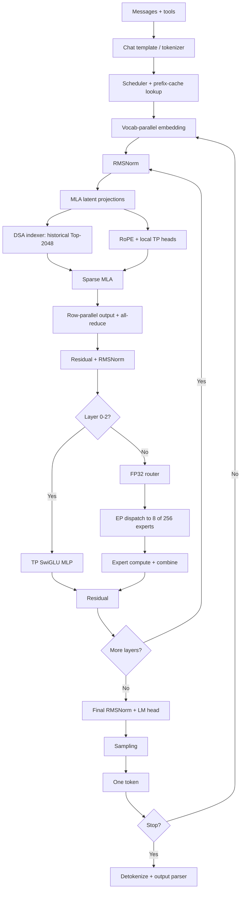

# vLLM Inference Path: GLM-5.2 as an Example

When a conversation request reaches vLLM, the server first arranges the system prompt, message history, tool definitions, and current question into one text sequence, which the tokenizer converts into token IDs. The model then performs prefill to produce the first output token. Each subsequent token is produced by a new decode step. This page assumes a TP8 and EP8 deployment without MTP.

## Model Shape

The parameters that directly determine the forward path are:

<table style="display: inline-block; text-align: left;">
  <thead>
    <tr>
      <th style="text-align: left;">Item</th>
      <th style="text-align: left;">Configuration</th>
    </tr>
  </thead>
  <tbody>
    <tr><td style="text-align: left;">Transformer layers</td><td style="text-align: left;">78</td></tr>
    <tr><td style="text-align: left;">Hidden size</td><td style="text-align: left;">6,144</td></tr>
    <tr><td style="text-align: left;">Attention heads</td><td style="text-align: left;">64</td></tr>
    <tr><td style="text-align: left;">Query latent rank</td><td style="text-align: left;">2,048</td></tr>
    <tr><td style="text-align: left;">KV latent rank</td><td style="text-align: left;">512</td></tr>
    <tr><td style="text-align: left;">Q/K dimension per head</td><td style="text-align: left;">256: 192 content + 64 RoPE</td></tr>
    <tr><td style="text-align: left;">V dimension per head</td><td style="text-align: left;">256</td></tr>
    <tr><td style="text-align: left;">Dense layers</td><td style="text-align: left;">First 3 layers</td></tr>
    <tr><td style="text-align: left;">MoE layers</td><td style="text-align: left;">Remaining 75 layers</td></tr>
    <tr><td style="text-align: left;">Routed experts</td><td style="text-align: left;">256; 8 selected per token</td></tr>
    <tr><td style="text-align: left;">Shared experts</td><td style="text-align: left;">1</td></tr>
    <tr><td style="text-align: left;">DSA indexer</td><td style="text-align: left;">32 heads, head dimension 128, Top-2048</td></tr>
    <tr><td style="text-align: left;">Maximum position configuration</td><td style="text-align: left;">1,048,576 tokens</td></tr>
  </tbody>
</table>

## Before Model Execution

### Chat Template and Tokenization

The user begins with natural-language text, such as "Explain KV cache." A Transformer does not process strings directly; it receives a sequence of token IDs. Before model execution begins, the server must first turn the user's input into a prompt in the format expected by the model.

The conversation usually also contains a system prompt and earlier messages. An OpenAI-compatible API represents this content in the `messages` field and includes a `tools` field when the model may call tools. GLM's chat template joins these inputs in the format used during training and inserts markers for roles, thinking, and tool definitions.

The tokenizer then converts the complete prompt into `(t_0, t_1, ..., t_{L-1})`. This sequence of token IDs is the Transformer's actual input.

### Scheduling and Prefix Cache

vLLM schedules tokens according to the current batch, free KV blocks, and `max_num_batched_tokens`. Complete prompt blocks found in the prefix cache do not run through prefill again; their per-layer KV state is reused. Only the uncached suffix traverses all 78 layers.

Prefix caching reduces repeated prefill work. It does not alter the model architecture or increase the amount of active KV state that fits in HBM.

## From Token IDs to Hidden States

The embedding table maps every token ID to a 6,144-dimensional vector:

$$
h_i^{(0)}=E[t_i].
$$

Under TP8, `VocabParallelEmbedding` shards the vocabulary rows. Each rank produces a contribution for tokens within its local range, and the TP group combines the result. The first Transformer layer receives one hidden state per token.

## One Transformer Layer

All 78 layers follow the same residual backbone:

$$
u^{(\ell)} = h^{(\ell)} +
\operatorname{Attn}\!\left(\operatorname{RMSNorm}(h^{(\ell)})\right),
$$

$$
h^{(\ell+1)} = u^{(\ell)} +
\operatorname{FFN}\!\left(\operatorname{RMSNorm}(u^{(\ell)})\right).
$$

Attention uses DSA to select historical positions and MLA to compute attention over them. The FFN is a dense MLP in the first three layers and an MoE block in the remaining 75.

### RMSNorm and the Residual Path

RMSNorm normalizes along the hidden dimension and applies a learned scale:

$$
\operatorname{RMSNorm}(h)=
\frac{h}{\sqrt{\operatorname{mean}(h^2)+\epsilon}}\odot\gamma.
$$

vLLM can fuse residual addition with RMSNorm to reduce HBM traffic. In ordinary TP8 execution, the residual and normalized hidden state remain complete on each TP rank; they are not split with the attention heads.

### MLA Projections and KV State

GLM-5.2 does not store 64 expanded K/V pairs for every historical token. It first projects Query and KV into low-rank spaces.

The Query path is:

$$
c_i^Q=W^{Q_A}h_i,
\qquad
q_i=W^{Q_B}\operatorname{RMSNorm}(c_i^Q).
$$

The KV path is:

$$
[c_i^{KV},k_i^R]=W^{KV_A}h_i.
$$

$c_i^{KV}$ is a 512-dimensional KV latent and $k_i^R$ is a 64-dimensional RoPE key. The main KV cache therefore stores about 576 elements per token per layer instead of materializing K and V for every head. The logical content Key and Value are:

$$
[k_i^C,v_i]=W^{KV_B}\operatorname{RMSNorm}(c_i^{KV}).
$$

An optimized MLA kernel can absorb $W^{KV_B}$ into attention, avoiding repeated expansion of full K/V for historical tokens.

The 256-dimensional Query contains a 192-dimensional content component and a 64-dimensional positional component:

$$
q_i=[q_i^C,q_i^R].
$$

RoPE is applied only to $q_i^R$ and $k_i^R$. The content components remain unchanged.

Under TP8, the A projections and the 512+64 latent path are replicated. `q_b_proj` and `kv_b_proj` are column-sharded by attention head, leaving eight heads on each GPU. This layout keeps the attention computation local while retaining a compressed KV state accessible to every rank.

### DSA Indexer

MLA reduces the bytes stored for each historical token, but reading every historical position remains expensive at long context lengths. DSA runs a smaller retrieval computation before the full attention operation.

The indexer derives 32 retrieval queries from the query latent and produces a shared key plus per-head aggregation weights from the hidden state:

$$
q_i^I=W_q^I c_i^Q,
\qquad
[k_i^I,w_i]=W_{kw}^I h_i.
$$

It scans the historical indexer cache with these lower-dimensional queries, combines the scores across heads, and keeps the highest-scoring 2,048 positions:

$$
\mathcal I_i=\operatorname{TopK}_{j,\,2048}
\left(
\sum_m w_{i,m}\operatorname{ReLU}
\left(\langle q_{i,m}^I,k_j^I\rangle\right)
\right).
$$

The indexer still scans the sequence, but with a smaller representation than the 64-head MLA operation. Contexts shorter than 2,048 tokens receive little sparsity benefit because nearly every available historical position is selected.

This checkpoint places full indexers at layers 0, 1, 2, 6, 10, 14, and then every fourth layer through layer 74. All other layers reuse the Top-K buffer from the nearest preceding full layer. DSA selection is therefore not recomputed in full at every layer.

The current vLLM implementation marks `wq_b` and the fused `wk_weights_proj` as replicated or `disable_tp=True`. TP8 repeats the indexer projections and historical scan on every rank. It shards attention heads, not a 160K sequence into eight independent 20K segments.

The indexer cache and main MLA KV cache are separate objects. On the A100 path, indexer keys are stored in FP8 with separate scales. With `--kv-cache-dtype auto`, the main MLA KV cache normally follows the BF16 model dtype.

### Sparse MLA Attention

After the indexer produces $\mathcal I_i$, full attention reads MLA KV state only at those positions:

$$
\alpha_{i,j}=
\operatorname{softmax}_{j\in\mathcal I_i}
\left(
\frac{q_i k_j^\mathsf T}{\sqrt{256}}
\right),
$$

$$
o_i=\sum_{j\in\mathcal I_i}\alpha_{i,j}v_j.
$$

The causal mask still applies: a token cannot read future positions. Each TP rank computes eight local heads. `o_proj` is row-sharded over its input dimension, and a TP all-reduce sums the partial outputs into a 6,144-dimensional attention result.

### Dense MLP

Layers 0 through 2 use a SwiGLU MLP:

$$
z=\operatorname{SiLU}(W_g u)\odot W_u u,
\qquad
y=W_d z.
$$

vLLM packs $W_g$ and $W_u$ into `gate_up_proj`. TP8 column-shards the intermediate dimension; `down_proj` is row-sharded and ends with an all-reduce.

### Mixture of Experts

Layers 3 through 77 replace the dense MLP with MoE. The router scores 256 experts and selects eight for each token:

$$
s_i=\operatorname{sigmoid}(W_r u_i),
\qquad
\mathcal E_i=\operatorname{TopK}_{e,\,8}(s_i+b).
$$

$b$ is the correction bias used only for expert selection. Routing weights for the selected experts come from the unbiased sigmoid scores. This checkpoint normalizes the eight selected scores and then applies a routed scaling factor of 2.5. The GLM path in vLLM uses FP32 router logits. Each routed expert is a SwiGLU MLP with intermediate size 2,048. The eight expert outputs are combined using their routing weights, together with the output of one shared expert.

EP8 distributes the 256 routed experts across eight GPUs. Tokens are dispatched to ranks that own the selected experts, processed by local expert GEMMs, and returned to their original order. The exact collective depends on the MoE backend; its semantics are dispatch and combine. The shared expert is not placed like a routed expert and normally follows the dense/TP path.

In a single-node `TP8+EP8` deployment, the same eight processes serve both roles. Attention and dense projections use TP sharding, while routed experts use EP placement. `TP7_EP7` describes one process whose rank is seven in both groups; it does not imply 64 processes.

## From the Last Layer to an Output Token

After all 78 Transformer layers have run, the model applies final RMSNorm to the residual result. The LM head projects the 6,144-dimensional hidden state to 154,880 vocabulary logits:

$$
z=W_{\text{vocab}}h^{\text{final}}.
$$

`ParallelLMHead` shards the vocabulary. Each TP rank computes its local range before the logits processor performs the required combination and post-processing. Temperature, top-p, top-k, repetition penalties, and grammar masks are applied here, resulting in one token ID.

The token is appended to the sequence. Unless EOS, a stop sequence, or `max_tokens` is reached, it passes through embedding and all 78 layers again. Without MTP, every generated token requires one complete target-model decode step.

The detokenizer converts token IDs back into text. Reasoning and tool-call parsers then recognize `<think>` sections, tool names, and arguments. If a tool is executed, its observation enters the chat template of the next model request.

## Prefill and Decode

Prefill and decode run the same model layers with different batch shapes.

| Phase | Input in one step | Main work | State produced |
| --- | --- | --- | --- |
| Prefill | Multiple uncached prompt tokens | Batched projections, DSA/MLA, and MoE | Per-layer MLA KV and indexer cache |
| Decode | One new token per active sequence | Read historical cache and run one full forward pass | KV and indexer entry for the new token |

Long-prompt prefill forms large GEMMs and can reach high GPU utilization. Decode uses narrower matrices while reading historical cache and paying TP collectives and EP routing costs. It is therefore more sensitive to memory bandwidth and communication latency. Continuous batching groups decode tokens from multiple sequences so that these narrow operations form a larger GPU workload.

## Execution Path

## Precision and Storage Boundaries

`AWQ-INT4` describes weight storage and GEMM kernels; it does not make the entire forward path INT4. This checkpoint primarily quantizes later attention projections and routed-expert linear layers. Its configuration excludes the first three layers, MLA A projections, indexer, shared experts, and LM head. Hidden states, residuals, and normalization remain primarily BF16.

The main MLA KV-cache dtype is controlled by the vLLM KV configuration. With `auto`, it normally remains BF16; an explicit FP8 KV setting is required to reduce it further. The FP8 DSA indexer cache is a separate storage path and does not imply that the main KV cache is FP8.

## Implementation References

- [GLM-5.2 AWQ-INT4 config](https://huggingface.co/cyankiwi/GLM-5.2-AWQ-INT4/blob/main/config.json)
- [IndexCache: Accelerating Sparse Attention via Cross-Layer Index Reuse](https://arxiv.org/abs/2603.12201)
- [vLLM `GlmMoeDsaForCausalLM` implementation](https://github.com/vllm-project/vllm/blob/main/vllm/model_executor/models/deepseek_v2.py)
- [vLLM MLA wrapper](https://github.com/vllm-project/vllm/blob/main/vllm/model_executor/layers/mla.py)
