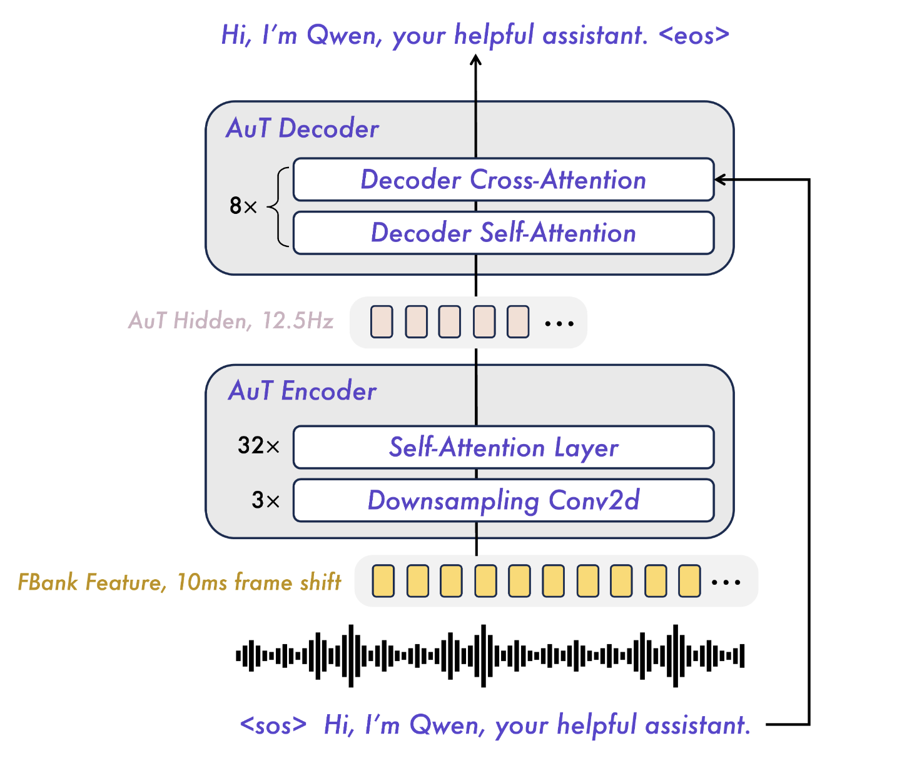

# Models

## Qwen3-Omni

### Overview

  

Main features of Qwen3-Omni:

-  Both the Thinker and Talker adopt Mixture-of-Experts (MoE) architectures.
-  Talker no longer consumes the Thinker’s high-level **text representations** and conditions only on audio and visual multimodal features.
   - for textual content, discrete tokens and embeddings are effectively information-equivalent.
- Since textual representations are decoupled, the Thinker and Talker can use distinct system prompts, independently controlling the Thinker’s response style and the Talker’s audio style.
- The Talker adopts a multi-codebook autoregressive scheme: Talker generates one codec frame per step, while the MTP module produces the remaining residual codebooks.
- The Code2Wav is implemented as a lightweight causal ConvNet, simplifying the final stage of audio synthesis.

### Audio Transformer (AuT)

  

- Audio Transformer (AuT) is an attention-encoder-decoder model, trained from scratch on 20 million hours of supervised audio data.
- AuT Encoder contains approximately 0.6B parameters.
- Filter bank features are time–frequency representations derived from short-time analysis of the waveform. A 10 ms frame shift (hop) means the analysis window advances by 10 ms each step.
- In Qwen3-Omni’s description, for audio inputs and audio extracted from video, we resample to 16 kHz and convert the raw waveform into a 128 channel mel-spectrogram with a 25 ms window and a 10 ms hop. Practically, this corresponds to overlapping frames such as 0–25 ms, 10–35 ms, 20–45 ms, etc. A common way to compute a mel-spectrogram is:
    - segment the waveform into overlapping frames (e.g., 25 ms window, 10 ms hop),
    - apply an FFT (or equivalent STFT) per frame to obtain a magnitude/power spectrum,
    - apply a mel-scaled filter bank to aggregate spectral energy into mel bands,
    - optionally apply log-compression (often used in practice, though not always explicitly stated).
- The filter bank features of the audio are downsampled 8 times using Conv2D blocks before the attention layers, from 100 Hz(10ms) to 12.5 Hz. Each frame of the audio representation corresponds to approximately an 80 ms segment of the original audio signal.
- Specifically, the training data includes 80% Chinese and English pseudo-labeled ASR data, 10% ASR data from other languages, and 10% audio understanding data.
- To balance the efficiency of real-time prefill caching with the performance for offline audio tasks, AuT utilizes flash attention with dynamic attention window sizes, covering attention query patterns ranging from 1 to 8 seconds.
