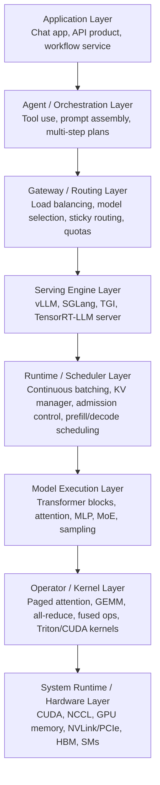

# AI Infra Overview

Modern inference is a stack, not a single framework. When people say they are "using vLLM" or "using SGLang", they are usually naming only one layer in a much larger online system. Real deployments also include application logic, orchestration, request routing, scheduling policy, model execution, kernel libraries, and hardware/runtime support underneath. Without a whole-stack view, it is easy to confuse where a bottleneck actually lives or which layer is responsible for solving it.

## Why an Overview Helps

Many AI Infra questions look similar on the surface but belong to different layers.

- If an agent workflow is too slow, the bottleneck may be prompt construction, tool latency, or request fan-out, not the serving engine itself.
- If throughput is low, the issue may lie in upper-layer routing or batching policy rather than in kernels.
- If one engine shows preemption or unstable latency, the root cause may be KV pressure, admission control, or deployment topology, not model quality.

An overview is useful because it separates these concerns before diving into individual mechanisms.

## Two Axes: Control Plane and Data Plane

One useful way to read the stack is to distinguish control plane from data plane.

- The **control plane** decides what should run, where it should run, and under what policy. It includes routing, quota, autoscaling, admission control, model selection, and agent-level orchestration.
- The **data plane** executes the request itself. It includes prompt preprocessing, serving-engine scheduling, model forward passes, kernels, memory movement, and hardware execution.

Most real systems cut across both planes. For example, upper-layer routing is a control-plane decision, but it directly affects data-plane cache locality and batch formation.

## Layered View of the Inference Stack

The following layered view is a practical way to organize the system:

### 1. Application Layer

This is where the user-facing product lives: chat, search, coding assistant, document pipeline, or enterprise workflow. This layer decides what user action should turn into an inference request and what business constraints matter, such as latency targets, session continuity, or cost ceilings.

### 2. Agent and Orchestration Layer

This layer constructs the actual workload sent to the model. It may include prompt assembly, retrieval, tool invocation, multi-turn memory, speculative branches, or task decomposition. Agent frameworks belong here. Their main role is not low-level execution efficiency, but workload shaping: they determine request size, request frequency, and cross-request structure.

### 3. Gateway and Routing Layer

This layer decides which backend receives each request. It includes external load balancing, model selection, sticky routing, traffic isolation, and multi-replica policies. For long-context serving, this layer matters more than it first appears because routing decisions directly affect prefix-cache locality, batch formation, and fairness across replicas.

### 4. Serving Engine Layer

This is where frameworks such as **vLLM** and **SGLang** usually sit. They provide the engine abstraction that accepts tokenized or structured requests and exposes generation APIs. They are not the whole stack; rather, they are the core serving substrate between upper-layer traffic management and lower-layer model execution.

Typical responsibilities of this layer include:

- request admission and lifecycle management
- batching and streaming interfaces
- KV-cache management and paging
- decode loop orchestration
- integration with distributed execution

### 5. Runtime and Scheduler Layer

Inside one serving engine, there is another layer of structure: the runtime. This is where internal scheduling happens. Continuous batching, chunked prefill, preemption, block allocation, admission control, and KV-pressure handling all live here.

This layer is often where performance is won or lost. Two deployments can use the same model and the same engine, yet behave very differently because their runtime policies differ.

### 6. Model Execution Layer

This is the mathematical model itself: attention blocks, MLPs, MoE routing, RoPE, sampling heads, and output logits. Questions such as "does this model use GQA?" or "how large is the KV cache per token?" belong here.

### 7. Operator and Kernel Layer

This layer implements the heavy lifting: GEMMs, fused kernels, paged attention, all-reduce, reduce-scatter, dispatch/combine, and custom Triton or CUDA kernels. It is where abstract model computation becomes real device work.

### 8. System Runtime and Hardware Layer

At the bottom sit CUDA, NCCL, GPU memory systems, interconnects such as NVLink or PCIe, and the hardware execution resources themselves. Bandwidth, memory capacity, collective latency, and kernel launch overhead all ultimately resolve at this layer.

## Where vLLM and SGLang Fit

vLLM and SGLang are best understood as **serving engines with substantial internal runtime logic**.

- They are below the application, agent, and external routing layers.
- They are above model kernels and hardware execution.
- They contain their own scheduler, batching logic, KV manager, and runtime policies.

So when someone says "we use vLLM", that typically means:

1. upper layers still decide what requests to send
2. vLLM handles request execution, batching, and internal runtime management
3. lower layers still determine the actual operator efficiency and hardware utilization

This is why engine-level tuning alone is never the whole story. A well-tuned engine can still underperform if the upper layer creates poor workload shape, and an excellent application policy can still be constrained by weak runtime scheduling or kernel efficiency.

## A Request Walkthrough

A single online request usually flows through the stack in roughly this order:

1. The application or agent layer decides that a model call is needed.
2. The orchestration layer assembles prompts, retrieved context, tool outputs, and decoding policy.
3. The routing layer chooses a model endpoint or replica.
4. The serving engine admits the request and places it into its internal scheduler.
5. The runtime allocates KV blocks, batches prefill or decode work, and decides when the request runs.
6. The model execution layer runs transformer computation.
7. The operator layer launches kernels and collectives.
8. The hardware/runtime layer executes those kernels and moves data.
9. Tokens stream back upward through the same stack.

Thinking in this sequence makes debugging easier because it localizes failure modes. For example:

- high TTFT may come from prompt assembly, queueing, or prefill cost
- low TPS may come from routing fragmentation, poor batching, or communication overhead
- unstable latency may come from scheduler pressure, KV exhaustion, or upper-layer fan-out behavior

## A Practical Reading Map

Within this notebook, the AI Infra pages can be read as a top-down decomposition of the middle of this stack:

- [Metrics](metrics.md): how behavior is measured
- [KV Cache](kv-cache.md): the central memory object of long-context serving
- [Serving Runtime](serving-runtime.md): how one engine schedules and stabilizes requests
- [Parallelism](parallelism.md): how execution is distributed across devices
- [Decoding and Sampling](decoding.md): how decode-time behavior is shaped
- [Training Objective](training-objective.md): the probabilistic base underlying inference-time outputs
