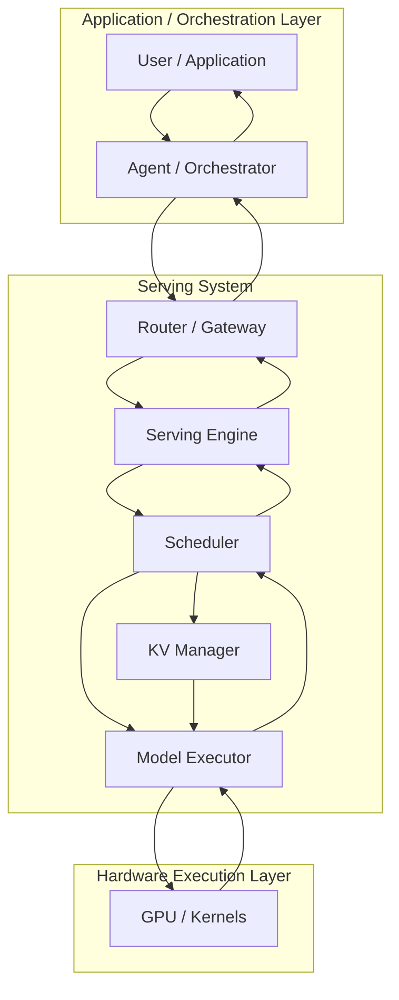
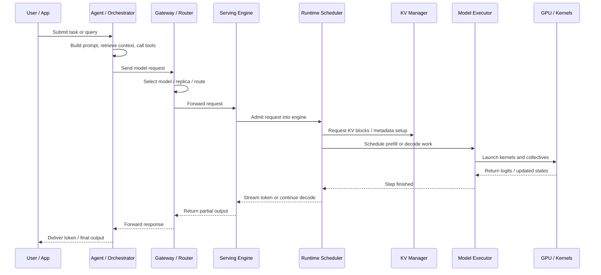

# Inference Request Lifecycle

When an online inference request feels slow or unstable, the root cause is often not obvious because the request passes through many layers before a token is emitted. A useful way to reason about the system is therefore not only by stack layers, but also by time: what happens first, what waits on what, and where latency or throughput is lost along the path.

This page follows one request from the application layer down to GPU execution and back to the user. The goal is to make performance debugging more concrete by connecting abstract layers to a real execution sequence.

## Why Lifecycle Matters

A request-level view is useful because many symptoms that appear identical at the API boundary come from different stages underneath.

- A high TTFT may come from prompt assembly, queueing, prefill cost, or runtime admission delays.
- Low throughput may come from routing fragmentation, weak batching, KV pressure, or kernel inefficiency.
- Latency jitter may come from upper-layer fan-out, runtime preemption, or communication imbalance.

Looking only at the final response time hides these distinctions. A lifecycle view exposes where the request spends time and which layer owns the bottleneck.

## Start with the Request Path

The easiest way to read the lifecycle is to begin with the layered flow rather than with a detailed time diagram. A request starts in the application layer, descends into the serving system, reaches hardware execution, and then climbs back up the stack as tokens stream out. That path already explains a large part of inference behavior: who shapes the request, who decides when it runs, who owns memory state, and where the actual compute happens.

The flowchart is useful because it separates three kinds of responsibility that are easy to mix together in practice.

### 1. Application / Orchestration Layer Shapes the Workload

The lifecycle begins before the serving engine sees anything. A chat system, coding assistant, search product, or workflow service decides that the next action requires a model call. In an agentic system, this stage may also include tool planning, retrieval, memory lookup, and prompt templating.

This layer determines the workload that will enter the system. Long prompts, aggressive fan-out, duplicated retrieval context, or poorly structured tool traces all increase the burden on the lower layers. When a request is already inflated here, no scheduler or kernel optimization can fully undo that cost later.

### 2. The Serving System Turns an API Call into Managed Execution

Most of the operational complexity lives in the middle layer. The request is no longer just a payload; it becomes a scheduled object with routing decisions, KV state, execution steps, and streaming outputs.

#### Router / Gateway

The router decides which model endpoint, replica group, or engine instance will receive the request. This affects not only infrastructure utilization but also cache locality and batch formation. Two requests with the same prefix may or may not benefit from prefix caching depending on whether they are routed to the same backend.

#### Serving Engine

Frameworks such as vLLM or SGLang receive the request and convert it into an internal engine object. At this point the external API boundary ends and the serving framework's own runtime lifecycle begins. The engine owns request admission, lifecycle tracking, and output streaming.

#### Scheduler and KV Manager

Once inside the engine, the scheduler decides when the request actually runs. It may enter prefill immediately, wait behind earlier work, or be interleaved with other requests through continuous batching. This is often where latency behavior becomes non-intuitive: a request may already be inside the engine but still not be making progress.

The scheduler does not act alone. It relies on the KV manager to allocate, attach, reuse, and reclaim KV state. During prefill, new KV blocks are materialized. During decode, existing blocks are extended or reused. Under memory pressure, the scheduler-KV-manager boundary becomes one of the most important control points in the system because it determines whether the engine can safely admit more work or must become more conservative.

#### Model Executor

The model executor turns runtime decisions into actual model steps. It launches prefill and decode work with the batch shape selected by the scheduler and the KV state prepared by the KV manager. This is the bridge between serving policy and model computation: batch formation, scheduling, and memory management all become visible here as execution shape.

### 3. The Hardware Layer Performs the Actual Computation

At the bottom of the stack, kernels run on the hardware: GEMMs, attention kernels, communication collectives, fused operations, sampling kernels, and memory movement. This is where operator efficiency, interconnect bandwidth, and kernel launch overhead finally show up as realized performance.

If utilization is low here, the root cause may still lie above. Too little work per decode step, excessive synchronization from the chosen parallelism strategy, or a request stream that never forms efficient batches can all surface as poor GPU utilization even when the kernels themselves are implemented well.

### 4. Tokens Return Through the Same Stack

After each decode step, outputs move back upward: from model executor to engine, from engine to router, from router to application, and finally to the user. For streaming products, this return path is part of the user experience rather than an implementation detail. The user does not experience one monolithic completion; the user experiences a sequence of partially delayed tokens.

## Then Read It as a Time Sequence

The flowchart answers one question: which layers and components does a request pass through? The time sequence answers a different question: in what order do these components interact during one request?

Reading both diagrams together makes the control flow easier to interpret. The flowchart gives the stable structure of the system. The sequence diagram shows one concrete traversal of that structure. When a latency or throughput problem appears, the practical debugging question is usually: which node in the flowchart is responsible, and at what point in the sequence does it start to dominate?

## Where Bottlenecks Usually Show Up

The same request-lifecycle view is useful for debugging.

- **High TTFT** often comes from orchestration overhead, queueing, prefill cost, or delayed admission.
- **Low TPS** often points to weak batch formation, KV pressure, communication overhead, or underfilled kernels.
- **Preemption** usually indicates pressure in the scheduler-KV-manager interaction.
- **Poor prefix-cache benefit** often originates in upper-layer routing rather than in the cache mechanism itself.
- **Low GPU utilization** may reflect too-small decode steps, communication-heavy topology, or a request stream that never forms efficient batches.

## Relationship to the Rest of AI Infra

This lifecycle view complements the stack overview rather than replacing it.

- [Overview](overview.md) explains where each component sits in the system.
- [Metrics](metrics.md) explains how the request lifecycle is measured.
- [KV Cache](kv-cache.md) explains the main runtime state object carried through prefill and decode.
- [Serving Runtime](serving-runtime.md) explains how the scheduler and runtime policies shape request progress.
- [Parallelism](parallelism.md) explains how execution is distributed once the request reaches model computation.
