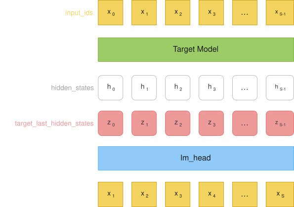
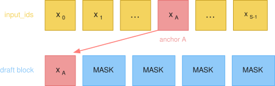
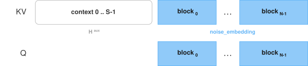
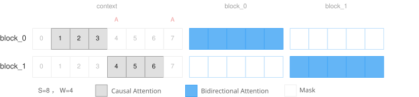
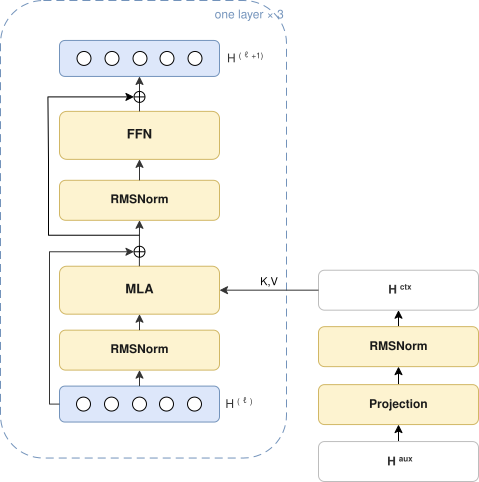
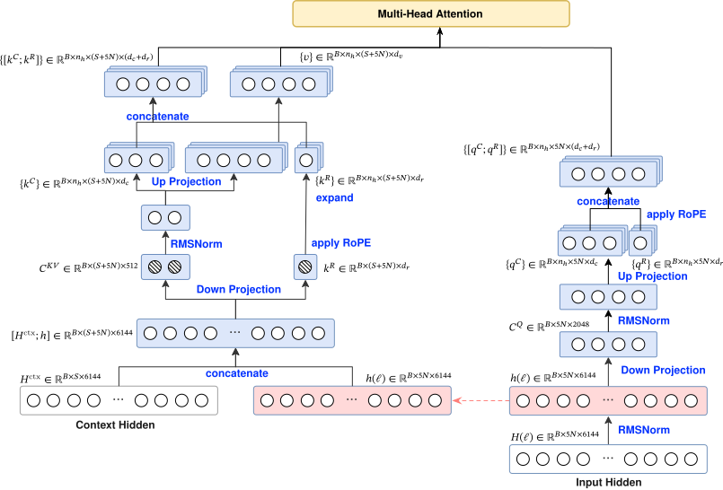

# GLM 5.2 DSpark 投机训练设计

## 参数摘要

Draft 为 \(L=3\) 层 GLM MLA，隐藏维与 Target 相同。数字取自 `configs/glm-5.2-dspark.json`。

**Width.** \(d=6144\)，\(n_h=64\)。Query 低秩 \(2048\)，KV 低秩 \(512\)；头维 \(d_c=192\)，\(d_r=64\)，\(d_v=256\)。FFN 中间维 \(12288\)。词表 \(V=154880\)，Markov 秩 \(256\)。block 长 \(5\)。Draft 用 SWA，窗口 \(W=128\)，看得见的 context 至多 \(W-1\) 个位置。

**Parameters.** 可训练参数约 \(1.37\mathrm{B}\)。冻结的 Target `embed_tokens` 与 `lm_head` 不计入。

| 块 | 参数量 |
|---|---|
| 投影（`mtp.0.main_proj`）与 RMSNorm（`main_norm`） | \(113\mathrm{M}\) |
| 每层 MLA | \(165\mathrm{M}\times 3=495\mathrm{M}\) |
| 每层 dense SwiGLU | \(226\mathrm{M}\times 3=679\mathrm{M}\) |
| Markov（`markov_w1`，`markov_w2`） | \(79\mathrm{M}\) |
| Confidence 与末层 RMSNorm | \(<0.1\mathrm{M}\) |

**KV cache.** MLA 每层每个被缓存 token 存 \(\mathbf{c}^{KV}\) 的 \(512\) 维与 \(k^{R}\) 的 \(64\) 维，共 \(576\) 个数；Query 与展开后的 \(K,V\) 不进 cache。Draft \(L=3\) 为 \(1728\) 个数，bf16 合 \(3.4\,\mathrm{KiB}/\mathrm{token}\)。Target \(78\) 层为 \(44928\) 个数，bf16 合 \(87.8\,\mathrm{KiB}/\mathrm{token}\)。Draft 推理时每层驻留窗口内约 \(W\) 个 token；\(3.4\,\mathrm{KiB}\) 与 \(87.8\,\mathrm{KiB}\) 是每个被缓存 token 的占用。

## 模型前向设计

### 1. 训练样本

如上述训练数据准备中的步骤，用数据集序列做 Target 模型一次 prefill，保存三个逐位对齐的张量供训练。

<div align="center">
  
</div>

1. `input_ids`：$[x_0, x_1, \ldots, x_{S-1}]$。数据集窗口，原样作为 Target prefill 的输入。Draft 的输入从该序列中采样 anchor tokens，见 [Anchor 采样](#anchor-sampling)。

2. `hidden_states`：$[h_0, h_1, \ldots, h_{S-1}]$。$h_i$ 由 $x_i$ 输入 Target 得到，因果上看见 $x_0,\ldots,x_i$。三路是 layer 75、76、77 做完后、下一层 `input_layernorm` 之前的 hidden state。层号从 0 计，共 78 层。拼成 $\mathbb{R}^{S\times 18432}$。

3. `target_last_hidden_states`：$[z_0, z_1, \ldots, z_{S-1}]$。$z_i$ 由 $x_i$ 输入 Target 得到，因果上看见 $x_0,\ldots,x_i$。走完 78 层再经 final RMSNorm，是 `lm_head` 的输入。形状 $\mathbb{R}^{S\times 6144}$。相对 $h_i$ 的最后一路（layer 77 输出），$z_i$ 只多这一步 RMSNorm。

### 2. 模型输入

<a id="anchor-sampling"></a>
#### Anchor 采样

从 `input_ids` 的下标里选 anchor。记下标为 \(A\)。候选须同时满足 \(A \in [0, S-2]\)、`loss_mask[A] = 1`、`loss_mask[A+1] = 1`。训练时从这些合法位置中随机取 \(N\) 个，\(N \le\) `num_anchors`。

#### Draft 输入

按上面抽到的 \(N\) 个 \(A\)，Draft 前向构造两路。

**Draft block.** 每个 \(A\) 对应长度 `block_size = 5`：第 0 位是 \(x_A =\) `input_ids[A]`，后四位填 `MASK`（token id \(154821\)）：```[x_A, MASK, MASK, MASK, MASK]```

<div align="center">
  
</div>

\(N\) 个 block 在序列维拼成 \(\mathbb{R}^{B \times 5N}\) 的 id，经 Target 冻结的 `embed_tokens` 得到 `noise_embedding` \(\in \mathbb{R}^{B \times 5N \times 6144}\)。

**Context.** 第二路是训练样本里那份长度为 \(S\) 的 `hidden_states`。此处先不按照 sliding window 裁切，后续通过[注意力掩码](#attention-mask)来约束 draft block 内每个位置实际能看见 context 的哪一段。记 \(\mathbf{H}^{\mathrm{aux}} \in \mathbb{R}^{B \times S \times 18432}\)。`mtp.0.main_proj` 将其投到 \(\mathbb{R}^{B \times S \times 6144}\)，再经 `main_norm`。该路不经过 embedding。两路如何拼成 Q/K/V，见 [KV 构造](#kv-construction)。


<a id="kv-construction"></a>
#### QKV 构造

进入 MLA 时，K/V 把两路拼在同一条序列轴上：context 在前、\(N\) 个 draft block 在后，长度 \(S+5N\)。Q 只含后面那 \(5N\) 个 draft 位置，和 KV 右半列对齐。

<div align="center">
  
</div>

前 \(S\) 个 KV 来自投影后的 \(\mathbf{H}^{\mathrm{aux}}\)；后 \(5N\) 个与 Q 同源，都是 `noise_embedding`。RoPE 跟 KV 轴同序：context 为 \(0,\ldots,S-1\)；第 \(n\) 个 block 为 \(A_n,\ldots,A_n+4\)。Q 用后半段位置，K 用整段。

<a id="attention-mask"></a>
### 3. 注意力掩码

记注意力掩码为 \(M\)（`attention_mask`）。\(M\) 决定每个 Q 可以看到哪些 KV。`sliding_window` \(= W = 128\) 时，窗口为 \(A-W+1 \le kv < A\)，即 \([A-127, A)\)，看得见的 context 位置有 \(W-1\) 个。\(N\) 个 \(A\) 的窗口不同，所以上一节的 context 必须整段保留。下图为两个 block，各用自己的 \(A\) 算窗口。

<div align="center">
  
</div>

**Causal attention.** KV 下标 \(< S\) 时，块内 5 个 Q 共用窗口 \([A-127, A)\)，不随块内偏移右移。该窗口不含 context 位置 \(A\)。

**Bidirectional attention.** KV 下标 \(\ge S\) 时，只看见本 block 的 5 个位置。块内双向，块间不可见。

**Padding block.** `block_keep_mask=0` 的 block 用来在合法 anchor 少于 `num_anchors` 时凑齐 batch。其 5 个 Q 对所有 KV 关掉：不看 context，也不看任何 draft block。

\(M\) 在调用 Draft 之前生成，作为 `attention_mask` 传入各层 MLA。之后按 `training.attention_backend` 走不同的 attention 实现，见附录 [Attention 实现](#appendix-attention-backend)。

<a id="mla"></a>
### 4. MLA

Draft 为 \(L=3\) 层 Transformer 结构。\(\mathbf{H}^{\mathrm{aux}}\) 经投影（`mtp.0.main_proj`）与 RMSNorm（`main_norm`）得到 \(\mathbf{H}^{\mathrm{ctx}}\in\mathbb{R}^{B\times S\times 6144}\)，三层共用，不随层更新。第 \(\ell\) 层的输入是 draft hidden \(\mathbf{H}^{(\ell)}\in\mathbb{R}^{B\times 5N\times 6144}\)，\(\mathbf{H}^{(0)}\) 为第2节 draft block 的 embedding（`noise_embedding`）：第0位 \(x_A\)，后四位 MASK。三层 MLA 使用同一份第 3 节的注意力掩码与同一份 `position_ids`。下图框外为一次投影，框内为一层。

<div align="center">
  
</div>

**MLA Projection.** 每层先对 \(\mathbf{H}^{(\ell)}\) 做 RMSNorm（`input_layernorm`），记 \(\mathbf{h}\in\mathbb{R}^{B\times 5N\times 6144}\)。下图左为 Key/Value，右为 Query；虚线把同一份 \(\mathbf{h}\) 接到 KV 的拼接。

<div align="center">
  
</div>

Query 只从 \(\mathbf{h}\) 做低秩投影（`q_a_proj`，\(6144\to 2048\)）得到 \(\mathbf{c}^{Q}\in\mathbb{R}^{B\times 5N\times 2048}\)，经 RMSNorm（`q_a_layernorm`）再展开（`q_b_proj`）为 \(n_h\) 组 \((d_c,d_r)\)，即 \(\{q^{C}\}\) 与 \(\{q^{R}\}\)，其中 \(n_h=64\)，\(d_c=192\)，\(d_r=64\)。\(q^{R}\) 先做 RoPE，再与 \(q^{C}\) 拼成 \(\{[q^{C};q^{R}]\}\in\mathbb{R}^{B\times n_h\times 5N\times(d_c+d_r)}\)。

Key/Value 的输入为拼接 \([\mathbf{H}^{\mathrm{ctx}};\mathbf{h}]\in\mathbb{R}^{B\times(S+5N)\times 6144}\)；每一层对该拼接重新投影。低秩投影（`kv_a_proj_with_mqa`）得到 \(\mathbf{c}^{KV}\in\mathbb{R}^{B\times(S+5N)\times 512}\) 与 \(k^{R}\in\mathbb{R}^{B\times(S+5N)\times 64}\)。

\(\mathbf{c}^{KV}\) 经 RMSNorm（`kv_a_layernorm`）再展开（`kv_b_proj`）为 \(n_h\) 组 \((d_c,d_v)\)，即 \(\{k^{C}\}\) 与 \(\{v\}\)，\(d_v=256\)。\(k^{R}\) 不经该展开，先做 RoPE，再复制到 \(n_h\)，与 \(\{k^{C}\}\) 拼成 \(\{[k^{C};k^{R}]\}\in\mathbb{R}^{B\times n_h\times(S+5N)\times(d_c+d_r)}\)。

缩放系数为 \((d_c+d_r)^{-1/2}\)。注意力按第 3 节的掩码 \(M\) 计算，经投影（`o_proj`，\(n_h d_v\to 6144\)）加回残差。

**RoPE.** 只旋转 \(d_r=64\) 的 rope 切片，nope 切片不旋转。旋转为 GLM-5.2 的 interleaved 相邻对（`rope_interleave=true`）。角度由第 2 节已构造的 `position_ids` 查询：Query 用后 \(5N\) 个位置 \(A,\ldots,A+4\)；Key 用整段，context 为 \(0,\ldots,S-1\)，draft 与 Query 同号。

**FFN.** 更新后的 draft hidden 再经 RMSNorm（`post_attention_layernorm`）与 dense SwiGLU（`intermediate_size=12288`，激活 `silu`），残差相加。最后一层额外 RMSNorm，得到 \(\mathbf{H}^{(L)}\in\mathbb{R}^{B\times 5N\times 6144}\)。

### 5. 输出头

第 4 节得到 \(\mathbf{H}^{(L)}\in\mathbb{R}^{B\times 5N\times 6144}\)。词表 logits 先过冻结的 Target `lm_head`，再加上最后一层（`mtp.2`）的 Markov 偏置。Confidence 是并行的标量头。

**LM head.** 冻结的 Target `lm_head`（\(6144\to V\)，\(V=154880\)）作用在 \(\mathbf{H}^{(L)}\) 上，得到 \(\mathbf{L}^{\mathrm{base}}\)。该矩阵从 Target checkpoint 载入，训练中不更新；teacher 用同一份矩阵作用在 \(z_{A+k}\) 上，见第 6 节。

**Markov head.** 前驱 \(\mathrm{prev}=(x_A,x_{A+1},x_{A+2},x_{A+3},x_{A+4})\)：第 0 位是 anchor，第 1–4 位是 gold token（teacher forcing）。Vanilla Markov（`markov_rank=256`）先把 prev 嵌入到 \(r=256\)（`markov_w1`），再线性映回词表（`markov_w2`，无偏置），得到 \(\mathbf{B}(\mathrm{prev})\)。Draft logits 为

\[
\mathbf{L}=\mathbf{L}^{\mathrm{base}}+\mathbf{B}(\mathrm{prev}).
\]

\(\mathbf{B}\) 只由 prev 决定，不读 \(\mathbf{H}^{(L)}\)。

**Confidence head.** 将 \(\mathbf{H}^{(L)}\) 与 prev 的 Markov 嵌入在最后一维拼接（宽度 \(6144+256\)），经无偏置线性层（`AcceptRatePredictor`）得到每个 draft 位置一个标量。监督见第 6 节。

### 6. 训练目标

**Label.** 每个 anchor \(A\) 对应长度为 `block_size=5` 的监督，与第 2 节 draft block 错开一位：

\[
y_k = x_{A+k+1},\qquad k=0,1,2,3,4
\]

即 \(\mathbf{y}=(x_{A+1},\ldots,x_{A+5})\)。第 \(k\) 步要预测的是 \(y_k\)。

**Alignment.** 第 \(k\) 步 Draft 用第 5 节 \(\mathbf{L}\) 的第 \(k\) 个切片，记 \(\mathbf{L}_k\)。Teacher 用同一份冻结 `lm_head` 作用在 \(z_{A+k}\) 上，记 \(\mathbf{T}_k=\mathrm{lm\_head}(z_{A+k})\)：Target 在看见 \(x_{A+k}\) 之后预测下一个 token。

**eval_mask.** \(A\) 的入选只要求 `loss_mask[A]` 与 `loss_mask[A+1]` 为 1，且 \(A\le S-2\)。读入时将 `loss_mask[S-1]` 置 0，因此 \(x_{S-1}\) 既不能当 anchor，也不能当 \(y_0\)。第 \(k\) 步计入损失须同时满足 \(A+k+1<S\)、`loss_mask[A+k+1]=1`、该 block 的 `block_keep_mask=1`。沿 block 做前缀 `cumprod`：某步一旦关掉，其后各步也关掉。

**CE.** \(\mathbf{L}_k\) 对 \(y_k\) 做交叉熵。系数 `dspark_ce_loss_alpha=1`。

**L1.** \(\mathrm{L1}_k=\lVert\mathrm{softmax}(\mathbf{L}_k)-\mathrm{softmax}(\mathbf{T}_k)\rVert_1\)。系数 `dspark_l1_loss_alpha=0.9`。

**Confidence.** 目标由该 L1 停梯度得到：

\[
a_k=\mathrm{clip}\!\left(1-\tfrac12\,\mathrm{L1}_k,\,0,1\right).
\]

第 5 节的标量对 \(a_k\) 做 BCE-with-logits。系数 `dspark_confidence_head_alpha=1`。

三项均按 `eval_mask` 逐步求和再平均，加权和为总损失。Recipe 为 `dspark_loss_mode=original`。

## 附录


### A.训练数据准备

#### Option 1: Megatron 方式

每条 `(role, content)` conversation 经 chat template tokenize 后视为一条 sequence。将打乱后的 sequence 展成一维 token 流，按固定长度 $L$（如 4096）切 sample：从当前 sequence 偏移处取 token，剩余长度不足时继续取后续 sequence，直到凑满 $L+1$。多取 1 个 token，使输入与 label 错位同长为 $L$（$\mathrm{tokens}=x_{0:L}$，$\mathrm{labels}=x_{1:L+1}$）。超长 sequence 按切点拆到多个 sample。epoch 末不足一个完整 sample 的尾段丢弃。

sequence 边界在预处理写入：每条 sequence 末尾追加 tokenizer EOS。拼装后形如：

```
[seq A][EOS][seq B][EOS][seq C ...]
 |------- sample i (4096+1) -------|---- sample i+1 ----
```

拼 4k 时按 token id 直接相接。EOS 已写在每条 sequence 末尾，训练时当作普通 token：该位置要被预测，随后 token 的 position 接着编号（整条 sample 为 $0,\ldots,L-1$），也可以 attend 到 EOS 之前的 sequence。

<pre hidden>
#### Megatron 代码证据

跨 sequence 补齐到 $L+1$，尾段按整除丢弃（源码标识符为 `document_*`）：

```cpp
// megatron/core/datasets/helpers.cpp :: build_sample_idx
num_samples = (num_epochs * tokens_per_epoch - add_extra_token_to_sequence) / seq_length;

remaining_seq_length = seq_length + add_extra_token_to_sequence;
// remaining > 0：++document_idx_index, doc_offset = 0  → 下一条 sequence
// remaining <= 0：在当前 sequence 内推进 doc_offset，结束本 sample
```

读样本时按 `sample_index` 跨 sequence 拼接，仅在仍不足 $L+1$ 时 pad：

```python
# megatron/core/datasets/gpt_dataset.py :: _query_document_sample_shuffle_indices
for i in range(doc_index_beg, doc_index_end + 1):
    sample_parts.append(self.dataset.get(self.document_index[i], offset=..., length=...))
# length < sequence_length + add_extra_token_to_sequence 时补 pad
```

多取 1 token，切成同长的 `tokens` / `labels`：

```python
# megatron/core/datasets/gpt_dataset.py
# GPTDatasetConfig.add_extra_token_to_sequence = True
tokens = text[:-1]
labels = text[1:]
```

预处理写入 EOS。Megatron API 将该 id 命名为 `eod`，与 `eos_id` 同值：

```python
# tools/preprocess_data.py  --append-eod
doc_ids.append(Encoder.tokenizer.eod)

# megatron/core/tokenizers/text/libraries/huggingface_tokenizer.py
def eod(self):
    return self.tokens_to_ids([self.eos_token])[0]
```

上述默认对应 pretrain recipe 三个 `False`。任一改为 `True` 时：`reset_position_ids` 使 EOS 后 position 从 0 重计，`reset_attention_mask` 使 EOS 后看不见前一条 sequence，`eod_mask_loss` 使 EOS 不进 loss。

```python
# src/megatron/bridge/recipes/utils/dataset_utils.py
GPTDatasetConfig(
    reset_attention_mask=False,
    reset_position_ids=False,
    eod_mask_loss=False,
)
```
</pre>

#### Option 2: 存Response部分

对完整序列做一次 target 前向，再按 `loss_mask` 上的监督段裁出保存窗口。令 `response_start` 为 mask 中 1 的最小下标，`response_end` 为最大下标加一；保存区间为 `[save_start, response_end)`，长度 `S = response_end - save_start`，其中 `save_start = max(response_start - C, 0)`，`C = 128` 为 `response_context_tokens`。监督段从 `<|assistant|>` 之后开始，包含 `<think>`。下图以 `C = 128`、监督段长度 512 示意：

```
save_start                          response_start              response_end
     |-------- C tokens -----------||---------- 512 tokens ----------|
```

ckpt 中四路序列长度均为 $S$，下标 $0,\ldots,S-1$ 与该窗口逐位对齐。窗口内监督段从下标 `response_start - save_start` 开始（上图为 `C`）。

| 张量 | 形状 | 含义 |
|---|---|---|
| `input_ids` | $[S]$ | 窗口内 token id |
| `loss_mask` | $[S]$ | 从窗口内监督段起点到末尾为 1，左侧 context 为 0 |
| `aux_hidden_state` | $[S, 18432]$ | layer 75、76、77 做完后、下一层 `input_layernorm` 之前的 hidden state，沿特征维拼接 |
| `hidden_state` | $[S, 6144]$ | 全部 78 层之后、final RMSNorm 的输出（`lm_head` 的输入）。aux 最后一路是 layer 77 输出、尚未 RMSNorm |

读入时额外把 `loss_mask` 的最后一个位置写成 0：DSpark 的 label 是 `input_ids[A+1]`，窗口末 token 不再作为预测目标，也不能再当 anchor。进入训练 batch 后，`aux_hidden_state` 改名为 `hidden_states`（draft context），`hidden_state` 改名为 `target_last_hidden_states`（teacher logits）。


<a id="appendix-attention-backend"></a>
### Attention 实现

第 3 节给出布尔掩码 \(M\in\{0,1\}^{5N\times(S+5N)}\)。\(Q\) 仅含 \(5N\) 个 draft 位置，\(K,V\) 对应长度为 \(S+5N\) 的拼接序列。对合法 block 中每个 query，\(M\) 在 context 段的非零至多 \(W-1\) 个（列下标落在 \([A-W+1,A)\)），在 draft 段的非零仅位于本 block 的 `block_size` 列；padding block 对应行全为 0。`training.attention_backend` 不改变 \(M\)，只选择其表示以及缩放点积注意力的实现。注意力为

\[
\mathrm{softmax}\!\left(\frac{QK^\top}{\sqrt{d}}+\Lambda(M)\right)V,
\]

其中 \(\Lambda(M)\) 在 \(M=1\) 处为 0，在 \(M=0\) 处为 \(-\infty\)。

`flex_attention` 为 GPU 默认。`create_dflash_block_mask` 将第 3 节的判定写成 FlexAttention 谓词 \(m(b,h,q,kv)\in\{0,1\}\)，再编译为 `BlockMask`：按块记录非零结构，全零块不参与 \(QK^\top\)。

`eager` 与 `sdpa` 由 `create_dflash_sdpa_mask` 将 \(M\) 物化为稠密布尔张量，形状 \([B,1,5N,S+5N]\)。随后 `Glm52DSparkAttention._dense_attention` 以显式矩阵乘与 softmax 计算上式。在 GLM-5.2 DSpark 中，这两个配置名均进入该实现。Ascend NPU 未提供 FlexAttention，训练配置取 `eager`。


