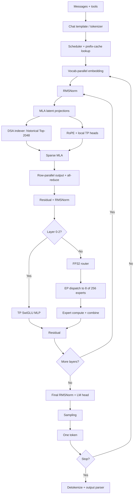

# vLLM 推理链路概览：以 GLM-5.2 为例

一条对话请求到达 vLLM 时，服务端先把 system prompt、历史消息、工具定义和当前问题排成一段文本，再由 tokenizer 转成 token ID。模型随后完成一次 prefill，生成第一个输出 token。此后的每个 token 都通过一次新的 decode step 产生。本文假定部署使用 TP8、EP8，不启用 MTP。


与后续计算路径直接相关的配置如下：

<div style="text-align: center; overflow-x: auto;">
<table style="display: inline-block; text-align: left;">
  <thead>
    <tr>
      <th style="text-align: left;">项目</th>
      <th style="text-align: left;">配置</th>
    </tr>
  </thead>
  <tbody>
    <tr><td style="text-align: left;">Transformer 层数</td><td style="text-align: left;">78</td></tr>
    <tr><td style="text-align: left;">hidden size</td><td style="text-align: left;">6,144</td></tr>
    <tr><td style="text-align: left;">attention heads</td><td style="text-align: left;">64</td></tr>
    <tr><td style="text-align: left;">query latent rank</td><td style="text-align: left;">2,048</td></tr>
    <tr><td style="text-align: left;">KV latent rank</td><td style="text-align: left;">512</td></tr>
    <tr><td style="text-align: left;">每个 head 的 Q/K 维度</td><td style="text-align: left;">256（192 维内容 + 64 维 RoPE）</td></tr>
    <tr><td style="text-align: left;">每个 head 的 V 维度</td><td style="text-align: left;">256</td></tr>
    <tr><td style="text-align: left;">Dense 层</td><td style="text-align: left;">前 3 层</td></tr>
    <tr><td style="text-align: left;">MoE 层</td><td style="text-align: left;">后 75 层</td></tr>
    <tr><td style="text-align: left;">routed experts</td><td style="text-align: left;">256，每个 token 选择 8 个</td></tr>
    <tr><td style="text-align: left;">shared experts</td><td style="text-align: left;">1</td></tr>
    <tr><td style="text-align: left;">DSA indexer</td><td style="text-align: left;">32 heads，head dim 128，Top-2048</td></tr>
    <tr><td style="text-align: left;">max model lengths</td><td style="text-align: left;">1,048,576 tokens</td></tr>
  </tbody>
</table>
</div>

## 请求进入模型之前

### 对话模板与分词

用户输入的是一段自然语言，例如“介绍一下 KV cache”。Transformer 不直接处理字符串，它接收的是一串 token ID。因此，在模型开始计算前，服务端要先把用户输入整理成模型能够识别的 prompt。

一次对话通常还包含 system prompt 和历史消息。OpenAI-compatible API 将这些内容组织在 `messages` 字段中。例如，一轮最简单的对话可以写成：

```json
{
  "messages": [
    {
      "role": "system",
      "content": "你是一个技术助手。"
    },
    {
      "role": "user",
      "content": "介绍一下 KV cache。"
    }
  ]
}
```

`role` 表示这段内容来自 system、user 还是 assistant，`content` 保存具体文本。对这组 `messages` 调用 checkpoint 自带的 chat template，并设置 `add_generation_prompt=True`，默认会得到：

```text
[gMASK]<sop><|system|>Reasoning Effort: Max<|system|>你是一个技术助手。<|user|>介绍一下 KV cache。<|assistant|><think>
```

`<|system|>`、`<|user|>` 和 `<|assistant|>` 标出不同角色的边界，末尾的 `<think>` 表示模型从这里开始生成 reasoning。如果请求中还包含 `tools` 字段，chat template 也会把工具定义和调用格式写入 prompt。

最后，tokenizer 将完整 prompt 转换为 `(t_0, t_1, ..., t_{L-1})`。这串 token ID 才是 Transformer 的实际输入。

### 调度与 prefix cache

prompt 转换为 token ID 后，并不一定一次全部进入模型。vLLM 的调度器会从运行中和等待中的请求里选择本轮需要计算的 token，同时受 token budget 和可用 KV blocks 限制。`max_num_batched_tokens` 给出了单次调度迭代的 token 数上限，当 prompt 很长时，prefill 可以被拆成多个 chunk。

分配新的 KV blocks 前，vLLM 会检查 prompt 开头是否已经存在于 prefix cache。命中的完整 blocks 可以直接复用，其中保存了各层 attention 所需的 KV 状态。未命中的后缀仍需经过全部 78 层并写入新的 KV blocks。即使整个 prompt 都命中，最后一个 token 通常仍需重新计算，以产生后续采样所需的 logits。

Prefix caching 不增加 KV cache 的物理容量。它允许多个请求共享相同前缀的 KV blocks，从而减少重复 prefill 和重复存储。各请求独有的后缀仍会继续消耗 KV 空间。

## 从 token ID 到 hidden state

token ID 是 token 在词表中的整数编号。GLM-5.2 的 embedding 矩阵 $E$ 包含 154,880 行，每一行都是一个 6,144 维向量。对于序列中的第 $i$ 个 token，其 ID 记为 $t_i$。Embedding lookup 取出矩阵的第 $t_i$ 行：

$$
h_i^{(0)} = E[t_i].
$$

$h_i^{(0)}$ 是该 token 进入第一层 Transformer 前的初始 hidden state。

TP8 部署不会让每张 GPU 都保存完整的 embedding 矩阵。`VocabParallelEmbedding` 将矩阵按词表行切成 8 份，每个 TP rank 只保存其中一段。对于一个 token ID，只有包含对应词表行的 rank 能查到它的 embedding，其他 rank 的局部结果为零。随后，8 个 rank 通过一次 all-reduce 得到完整结果。进入第一层 Transformer 时，每个 rank 都持有相同的 6,144 维 hidden state。

## Transformer 层结构

78 层 Transformer 虽然使用不同的 FFN 结构，但都遵循相同的 Pre-Norm 残差框架。RMSNorm 位于 Attention 和 FFN 之前，每个子层的输出随后加回残差路径。设 $h^{(\ell)}$ 为第 $\ell$ 层的输入。Attention 子层首先执行以下计算：

$$
u^{(\ell)} = h^{(\ell)} +
\operatorname{Attn}\!\left(
\operatorname{RMSNorm}(h^{(\ell)})
\right).
$$

$u^{(\ell)}$ 是 Attention 之后的中间状态。模型随后执行第二次 RMSNorm 和 FFN，并再次通过残差连接得到下一层的输入：

$$
h^{(\ell+1)} = u^{(\ell)} +
\operatorname{FFN}\!\left(
\operatorname{RMSNorm}(u^{(\ell)})
\right).
$$

Attention 负责从当前 token 可见的上下文中读取信息。GLM-5.2 先通过 DSA 选择参与计算的位置，再由 MLA 计算Attention。FFN 负责进一步变换当前 token 的表示。前三层使用 Dense MLP，后 75 层使用 MoE。

### RMSNorm 与残差路径

RMSNorm 分别归一化每个 token 的 6,144 维 hidden state。设其中一个 token 的 hidden state 为 $h$。RMSNorm 先计算所有 hidden dimensions 的均方根，再用它缩放 $h$：

$$
\operatorname{RMSNorm}(h)=
\frac{h}{\sqrt{\operatorname{mean}(h^2)+\epsilon}}
\odot\gamma.
$$

其中，$\operatorname{mean}(h^2)$ 表示对 $h$ 的 6,144 个分量取平方后求平均，$\epsilon$ 用于避免除零，$\gamma$ 是逐维学习的缩放参数，$\odot$ 表示逐元素乘法。

在 vLLM 中，残差相加和紧随其后的 RMSNorm 可以由同一个 kernel 完成。这样无需先将相加后的中间结果写回 HBM，再由 RMSNorm 重新读取（详见[算子融合](operator-fusion.md)）。

本文假定的普通 TP8 部署不会把这里的 6,144 维 hidden state 切成 8 份。每个 TP rank 都持有相同的完整向量，并独立执行 RMSNorm。TP 切分发生在随后进入 Attention 或 FFN 的线性投影中。

### MLA 投影与 KV 状态

普通多头注意力会为每个历史 token 保存 64 组 Key 和 Value。GLM-5.2 中每个 head 的 Key 和 Value 都是 256 维，因此每个 token、每层需要保存的逻辑 K/V 一共有：

$$
64\times(256+256)=32{,}768
$$

个元素。MLA 不直接缓存这些展开后的 K/V，而是让 Query 和 KV 分别经过低秩投影。只有 KV 的压缩状态会写入 KV cache。

#### Query 低秩投影

设第 $i$ 个 token 进入 Attention 的 hidden state 为 $h_i\in\mathbb{R}^{6144}$。Query 先被压缩为 2,048 维 latent，再展开为 64 个 256 维 heads：

$$
c_i^Q=W^{Q_A}h_i,
\qquad
q_i=\operatorname{reshape}\!\left(
W^{Q_B}\operatorname{RMSNorm}(c_i^Q)
\right),
$$

完成这两步变换的A和B投影矩阵分别为：

$$
W^{Q_A}\in\mathbb{R}^{2048\times6144},
\qquad
W^{Q_B}\in\mathbb{R}^{16384\times2048}.
$$

$W^{Q_A}$ 将 6,144 维 hidden state 压缩为 $c_i^Q\in\mathbb{R}^{2048}$。RMSNorm 不改变 latent 维度。$W^{Q_B}$ 再将其投影为 16,384 维向量，随后 reshape 为 $q_i\in\mathbb{R}^{64\times256}$。

对于任意第 $j$ 个 head，256 维 Query 又分为 192 维内容部分和 64 维位置部分：

$$
q_{i,j}=[q_{i,j}^C,q_{i,j}^R],
\qquad
q_{i,j}^C\in\mathbb{R}^{192},
\quad
q_{i,j}^R\in\mathbb{R}^{64}.
$$

#### KV 低秩投影与缓存

KV 路径通过一次 A 投影同时生成 512 维 KV latent 和 64 维 RoPE key：

$$
[c_i^{KV},k_i^R]=W^{KV_A}h_i,
\qquad
c_i^{KV}\in\mathbb{R}^{512},
\quad
k_i^R\in\mathbb{R}^{64}.
$$

A 投影矩阵的形状为：

$$
W^{KV_A}\in\mathbb{R}^{576\times6144}.
$$

$W^{KV_A}$ 的前 512 个输出分量构成 $c_i^{KV}$，后 64 个输出分量构成 $k_i^R$。

vLLM 对 $c_i^{KV}$ 执行 RMSNorm，并对 Query 和 Key 的位置部分应用 RoPE：

$$
\hat c_i^{KV}=\operatorname{RMSNorm}(c_i^{KV}),
$$

$$
\tilde q_{i,j}^R=\operatorname{RoPE}_i(q_{i,j}^R),
\qquad
\tilde k_i^R=\operatorname{RoPE}_i(k_i^R).
$$

主 KV cache 实际保存的是 $\hat c_i^{KV}$ 和 $\tilde k_i^R$，合计 $512+64=576$ 个元素。普通多头注意力需要保存 64 个 heads 的完整 Key 和 Value，共 $64\times(256+256)=32{,}768$ 个元素，因此 MLA 的缓存元素数量减少到大约 $1/57$。Query 只服务于当前计算，不会写入 KV cache。

归一化后的 512 维 KV latent 先经过 B 投影：

$$
z_i^{KV}=W^{KV_B}\hat c_i^{KV},
\qquad
W^{KV_B}\in\mathbb{R}^{28672\times512}.
$$

输出 $z_i^{KV}$ 一共有 28,672 个分量，正好对应 64 个 heads 各自所需的 192 维内容 Key 和 256 维 Value：

$$
28{,}672=64\times(192+256).
$$

按 head reshape 并拆分后：

$$
[k_i^C,v_i]=\operatorname{reshape}\!\left(z_i^{KV}\right),
\qquad
k_i^C\in\mathbb{R}^{64\times192},
\quad
v_i\in\mathbb{R}^{64\times256}.
$$

因此，每个 head 得到 192 维的内容 Key 和 256 维的 Value。第 $j$ 个 head 的内容 Key 再与共享的 64 维 RoPE key 拼接，形成完整的 256 维 Key：

$$
k_{i,j}=[k_{i,j}^C,\tilde k_i^R]\in\mathbb{R}^{256}.
$$

这些 K/V 是数学上的计算结果。decode 时可以通过[矩阵吸收](mla-matrix-absorption.md)改变乘法顺序，让历史 token 的压缩 latent 直接参与 attention，无需先展开为 64 组完整 K/V。

在 TP8 中，A 投影在各 rank 上复制，因此每个 rank 都会得到相同的 Query latent 和压缩 KV 状态。`q_b_proj` 和 `kv_b_proj` 按 heads 切分，每个 rank 持有 8 个 heads 对应的 B 投影参数，并使用压缩 KV cache 计算这 8 个 heads 的 attention 输出。

由于 512 维 KV latent 和 64 维 RoPE key 在所有 attention heads 之间共享，按 heads 进行 TP 切分不会切分主 KV cache。对于长度为 $T$ 的序列，每个 TP rank、每层仍需保存 $T\times576$ 个 KV 元素。

### DSA Indexer

MLA 降低了每个历史 token 的缓存体积，但在超长上下文中读取全部历史位置仍然昂贵。DSA 先用一个较小的 Indexer 为历史位置打分，再将得分最高的 2,048 个位置交给正式 attention。

对于当前 token $i$，Indexer 从 query latent 生成 32 个 128 维的检索 Query：

$$
q_i^I=\operatorname{reshape}\!\left(W_q^I c_i^Q\right)
\in\mathbb{R}^{32\times128}.
$$

它还从每个 token 的 hidden state 生成一个 128 维 Key 和 32 个聚合权重：

$$
[k_i^I,w_i]=W_{kw}^I h_i,
\qquad
k_i^I\in\mathbb{R}^{128},
\quad
w_i\in\mathbb{R}^{32}.
$$

设 $j$ 表示一个历史位置，$m$ 表示一个 Indexer head。32 个 heads 分别计算当前 token 与位置 $j$ 的相关性，再通过 $w_{i,m}$ 合并为该位置的分数：

$$
s_{i,j}=
\sum_{m=1}^{32}
w_{i,m}\operatorname{ReLU}
\left(\left\langle q_{i,m}^I,k_j^I\right\rangle\right).
$$

Indexer 按分数选出最高的 2,048 个历史位置：

$$
\mathcal I_i=\operatorname{TopK}_{j,\,2048}\left(s_{i,j}\right).
$$

位置集合 $\mathcal I_i$ 随后交给正式 attention。64 个 MLA heads 都只在这组历史位置上计算。在一次 Indexer 扫描中，每个历史位置只需读取一份由 32 个 Indexer heads 共享的 128 维 Key，再与当前 token 的 32 个检索 Query 计算相关性。其代价低于让 64 个 MLA heads 读取全部历史位置的 MLA KV。历史长度不足 2,048 时，$\mathcal I_i$ 会包含所有可用位置，DSA 此时无法减少正式 attention 需要访问的位置数量。

按从 0 开始的层编号，该 checkpoint 在第 0、1、2、6、10、14……74 层重新运行 Indexer，并将选出的位置写入 Top-K buffer。其余层直接读取 buffer 中最近一次生成的位置集合。

vLLM 将两组 Indexer 投影（`wq_b` 和融合后的 `wk_weights_proj`）复制到每个 TP rank。TP8 下，每个 rank 都独立扫描完整的历史序列，并得到相同的 Top-K 位置集合。随后，64 个 MLA heads 被分到 8 个 rank，每个 rank 负责其中 8 个 heads 的正式 attention 计算。

### Sparse MLA Attention

Indexer 选出位置集合 $\mathcal I_i$ 后，64 个 MLA heads 分别在这些位置上计算 attention。设 $m$ 表示 attention head，$j$ 表示历史位置。第 $m$ 个 head 的 attention 权重为：

$$
\alpha_{i,m,j}=
\operatorname{softmax}_{j\in\mathcal I_i,\,j\le i}
\left(
\frac{q_{i,m}k_{j,m}^{\mathsf T}}{\sqrt{256}}
\right).
$$

它对所选位置的 Value 进行加权求和：

$$
o_{i,m}=
\sum_{\substack{j\in\mathcal I_i\\j\le i}}
\alpha_{i,m,j}v_{j,m}.
$$

条件 $j\le i$ 表示 causal mask。当前位置只能读取自己以及之前的 token，不能读取后续位置。

TP8 下，每个 rank 计算其中 8 个 heads，并将这 8 个 heads 的输出送入本地的 `o_proj`。`o_proj` 按输入维度切分，因此每个 rank 都得到一份 6,144 维的部分结果。TP all-reduce 将 8 份部分结果相加，得到完整的 attention 输出。

### Dense MLP

第 0 到第 2 层使用 SwiGLU MLP：

$$
z=\operatorname{SiLU}(W_g u)\odot W_u u,
\qquad
y=W_d z.
$$

vLLM 把 $W_g$ 和 $W_u$ 融合为 `gate_up_proj`。TP8 对 intermediate dimension 做列切分；`down_proj` 使用行切分，末尾通过 all-reduce 汇总。

### MoE

第 3 到第 77 层用 MoE 取代 Dense MLP。Router 为每个 token 计算 256 个专家分数，并选择其中 8 个：

$$
s_i=\operatorname{sigmoid}(W_r u_i),
\qquad
\mathcal E_i=\operatorname{TopK}_{e,\,8}(s_i+b).
$$

其中 $b$ 是仅用于专家选择的 correction bias。选中专家的 routing weight 取自未加 bias 的 sigmoid 分数；该 checkpoint 会将 8 个分数归一化，再乘以 2.5 的 routed scaling factor。GLM 的 vLLM 路径使用 FP32 router logits。每个 routed expert 都是 intermediate size 为 2,048 的 SwiGLU MLP。8 个专家输出按 routing weight 合并，同时加入一个 shared expert 的输出。

EP8 把 256 个 routed experts 分布到 8 张 GPU 上。token 根据路由结果发送到持有目标专家的 rank，完成本地 expert GEMM 后再回到原 token 顺序。具体 collective 由 MoE backend 决定，通信语义都是 dispatch 与 combine。shared expert 不按 routed expert 的放置方式分散，通常走 Dense/TP 路径。

在单机 `TP8+EP8` 中，同一组 8 个进程同时承担两种角色：Attention 与 Dense 投影按 TP 切分，routed experts 按 EP 放置。`TP7_EP7` 表示一个进程在两个组中的 rank 都是 7，并不意味着系统启动了 64 个 rank。

## 从最后一层到输出 token

78 层 Transformer 计算结束后，模型对 residual 合并结果执行 final RMSNorm。LM head 将 6,144 维 hidden state 投影到 154,880 维词表 logits：

$$
z=W_{\text{vocab}}h^{\text{final}}.
$$

`ParallelLMHead` 按词表切分。各 TP rank 计算自己的词表区间，logits processor 再完成必要的合并与后处理。temperature、top-p、top-k、repetition penalty 和 grammar mask 都发生在这一阶段，最终得到一个 token ID。

token ID 随即被追加到序列。若未遇到 EOS、stop sequence 或 `max_tokens`，它会重新经过 embedding 和全部 78 层。没有 MTP 时，每产生一个输出 token 都需要一次完整的 target-model decode step。

Detokenizer 将 token ID 流还原为文本；reasoning parser 和 tool-call parser 在这里识别 `<think>`、工具名及参数。工具调用若被执行，其 observation 会在下一轮重新进入 chat template，形成新的模型请求。

## Prefill 与 Decode

Prefill 和 Decode 执行同一组模型层，batch 形状不同。

| 阶段 | 本轮输入 | 主要工作 | 生成的状态 |
| --- | --- | --- | --- |
| Prefill | prompt 中尚未缓存的多个 token | 大批量投影、DSA/MLA、MoE | 每层 MLA KV 与 indexer cache |
| Decode | 每条 active sequence 的一个新 token | 读取历史 cache，完成一次全层前向 | 新 token 的 KV 与 indexer entry |

长 prompt 的 prefill GEMM 较大，通常能提供较高 GPU 利用率。Decode 的单步矩阵较窄，还要读取历史 cache、执行 TP collective 和 EP 路由，所以更容易受显存带宽与通信延迟限制。Continuous batching 把多条 sequence 的 decode token 合并，目的是把这些窄计算重新组成可利用 GPU 的 batch。

## 执行路径



## 精度与存储边界

`AWQ-INT4` 描述的是权重存储与 GEMM kernel，不代表整条推理路径都使用 INT4。这个 checkpoint 主要量化后部 attention 投影和 routed-expert 线性层；前三层、MLA A 投影、indexer、shared experts 和 LM head 等模块在配置中被排除。hidden states、residual 和 normalization 仍以 BF16 为主。

主 MLA KV cache 的 dtype 由 vLLM 的 KV 配置决定。使用 `auto` 时通常为 BF16；显式设置 FP8 KV 才会进一步降低其字节数。DSA indexer cache 的 FP8 存储是另一条独立路径，不能据此推断主 KV 也是 FP8。

## 实现依据

- [GLM-5.2 AWQ-INT4 config](https://huggingface.co/cyankiwi/GLM-5.2-AWQ-INT4/blob/main/config.json)
- [GLM-5.2 chat template](https://huggingface.co/cyankiwi/GLM-5.2-AWQ-INT4/blob/main/chat_template.jinja)
- [IndexCache: Accelerating Sparse Attention via Cross-Layer Index Reuse](https://arxiv.org/abs/2603.12201)
- [vLLM `GlmMoeDsaForCausalLM` implementation](https://github.com/vllm-project/vllm/blob/main/vllm/model_executor/models/deepseek_v2.py)
- [vLLM MLA wrapper](https://github.com/vllm-project/vllm/blob/main/vllm/model_executor/layers/mla.py)
