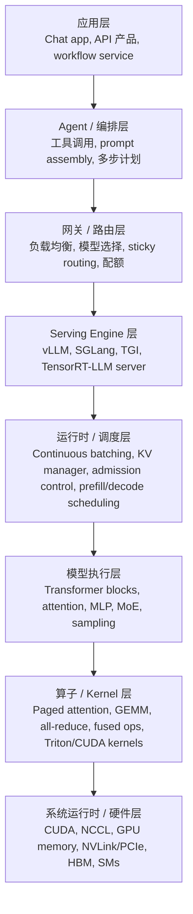

# AI Infra 总览

现代推理系统是一个完整的技术栈，而不是某一个单独框架。当人们说“我们在用 vLLM”或者“我们在用 SGLang”时，通常只是在指这个大系统中的一层。真实部署里还包括应用逻辑、agent 编排、请求路由、调度策略、模型执行、算子库，以及底层的运行时和硬件支持。如果没有一个全栈视角，就很容易把瓶颈归错层，或者误判到底该由哪一层来解决问题。

## 为什么需要总览

很多 AI Infra 问题表面上看起来相似，但本质上属于不同层。

- 如果一个 agent workflow 很慢，瓶颈可能在 prompt 组装、工具调用延迟，或者请求 fan-out，而不一定在 serving engine 本身。
- 如果吞吐低，问题可能在上层路由或 batching 策略，而不一定在 kernel。
- 如果某个 engine 出现 preemption 或延迟抖动，根因可能是 KV 压力、准入控制或部署拓扑，而不一定是模型本身。

总览的价值就在于先把这些层次拆开，再去讨论具体机制。

## 两条轴线：控制面与数据面

理解这个系统，一个很有用的方法是先区分控制面和数据面。

- **控制面（control plane）** 决定什么应该运行、在哪里运行、按什么策略运行。它包括路由、配额、自动扩缩容、准入控制、模型选择，以及 agent 级编排。
- **数据面（data plane）** 负责真正执行请求。它包括 prompt 预处理、serving engine 内部调度、模型前向、kernel 执行、内存移动，以及硬件上的实际运行。

真实系统往往横跨这两条轴线。比如上层路由是控制面决策，但它会直接影响数据面的 cache 局部性和 batch 形成方式。

## 推理系统的分层视图

下面这张图是一个比较实用的分层方式：

### 1. 应用层

这一层是最终用户直接接触到的产品形态，例如聊天系统、搜索系统、编码助手、文档处理流水线或企业 workflow。它决定什么用户行为会触发模型调用，以及系统真正关心的业务约束是什么，比如延迟目标、会话连续性或成本上限。

### 2. Agent 与编排层

这一层负责把业务需求组织成真正的模型负载。它可能包括 prompt 组装、检索增强、工具调用、多轮记忆、分支推理或任务拆解。各种 agent framework 都属于这一层。它的主要作用不是底层执行效率，而是 workload shaping，也就是决定请求有多大、请求有多频繁，以及请求之间是否存在结构上的相似性。

### 3. 网关与路由层

这一层负责决定每个请求被送往哪个后端。它包括外部负载均衡、模型选择、sticky routing、流量隔离和多副本流量策略。对长上下文 serving 来说，这一层比看起来更重要，因为路由决策会直接影响 prefix cache 局部性、batch 形成方式，以及不同副本之间的公平性。

### 4. Serving Engine 层

这一层通常就是 **vLLM**、**SGLang** 这类框架所在的位置。它们提供 engine 抽象，对上接受 tokenized 或结构化请求，对外暴露 generation API。它们并不是整个系统本身，而是处在上层流量管理和下层模型执行之间的核心 serving substrate。

这一层常见职责包括：

- 请求准入与生命周期管理
- batching 与 streaming 接口
- KV cache 管理与 paging
- decode loop 编排
- 与分布式执行的集成

### 5. 运行时与调度层

在一个 serving engine 内部，其实还有更细的一层结构，也就是 runtime。本层负责内部调度。continuous batching、chunked prefill、preemption、block 分配、准入控制和 KV 压力处理都属于这里。

这一层往往决定了系统的真实性能。即使模型相同、engine 相同，不同 runtime 策略也可能导致完全不同的行为。

### 6. 模型执行层

这一层是模型本身的数学结构：attention blocks、MLP、MoE routing、RoPE、sampling head 和输出 logits。像“这个模型是不是 GQA”“每个 token 的 KV 状态有多大”这种问题，都属于这一层。

### 7. 算子与 Kernel 层

这一层负责真正的重计算：GEMM、fused kernel、paged attention、all-reduce、reduce-scatter、dispatch/combine，以及各种 Triton 或 CUDA kernel。它是抽象模型计算转化为真实设备工作量的地方。

### 8. 系统运行时与硬件层

最底层是 CUDA、NCCL、GPU 显存系统、NVLink/PCIe 这样的互联，以及硬件本身的执行资源。带宽、显存容量、collective 延迟和 kernel launch 开销，最终都会落到这一层。

## vLLM 和 SGLang 在哪里

理解 vLLM 和 SGLang，一个比较准确的方式是把它们看成 **带有大量内部 runtime 逻辑的 serving engine**。

- 它们位于应用层、agent 层和外部路由层之下。
- 它们位于模型 kernel 和硬件执行之上。
- 它们内部自带 scheduler、batching 逻辑、KV manager 和一整套 runtime 策略。

所以当有人说“我们在用 vLLM”时，通常意味着：

1. 上层系统仍然负责决定发什么请求
2. vLLM 负责请求执行、batching 和内部 runtime 管理
3. 下层系统仍然决定实际算子效率和硬件利用率

这也是为什么只调 engine 参数从来不是全部答案。即使 engine 本身调得很好，如果上层 workload 形状不好，性能依然可能很差；反过来，上层策略再好，如果 runtime 调度或 kernel 效率不足，也仍然会被卡住。

## 一次请求是怎样穿过整个栈的

一条在线请求通常会大致按下面的顺序流过整个系统：

1. 应用层或 agent 层决定需要一次模型调用。
2. 编排层组装 prompt、检索上下文、工具输出和 decoding policy。
3. 路由层选择具体的模型端点或副本。
4. Serving engine 接收请求，并将其送入内部 scheduler。
5. Runtime 分配 KV blocks，对 prefill 或 decode 进行 batching，并决定这个请求何时执行。
6. 模型执行层运行 transformer 计算。
7. 算子层发起 kernels 和 collectives。
8. 硬件/runtime 层执行这些 kernels 并搬运数据。
9. 生成出的 token 再沿着同一条链路向上返回。

按照这个顺序思考问题，调试会容易很多。例如：

- TTFT 高，可能来自 prompt 组装、排队，或者 prefill 成本
- TPS 低，可能来自路由碎片化、batching 不充分，或者通信开销
- 延迟不稳定，可能来自 scheduler 压力、KV 耗尽，或者上层 fan-out 行为

## 在本笔记中的阅读路径

在这套 notebook 里，AI Infra 各页可以理解为对这条栈中间部分的逐层拆解：

- [指标](metrics.md)：系统行为如何被测量
- [KV Cache](kv-cache.md)：长上下文 serving 的核心内存对象
- [推理运行时](serving-runtime.md)：单个 engine 如何调度和稳定请求
- [并行策略](parallelism.md)：执行如何分布到多个设备上
- [解码与采样](decoding.md)：decode 行为如何被塑造
- [训练目标](training-objective.md)：推理输出背后的概率学基础
