# Qwen3-4B DSpark 训练消融

## 实验设置

以 Qwen3-4B 为冻结的Target模型，训练五层 DSpark draft。目标模型的 token embedding 与 LM head 保持冻结。各实验训练 2,616 个optimizer steps，约一个 epoch，占完整scheduler的 10%。具体设置如下。

| **项目** | 设置 |
|---|---|
| **训练数据** | Open PerfectBlend；经目标模型重新生成回复并缓存特征，共 1,339,875 个样本 |
| **Regen 采样** | Non-thinking；temperature 0.7，top-p 0.8，top-k 20，min-p 0；每次回复最多生成 4096 tokens（不含 prompt） |
| **最大序列长度** | 4096 tokens（完整对话，含 prompt与response）。 |
| **Draft 架构** | 5 层；隐藏维度 2560；FFN 中间维度 9728；GQA：32 个 Q heads、8 个 KV heads，head dim 128 |
| **Aux 层** | `[1, 9, 17, 25, 33]` |
| **Block size** | 7；Backbone 输入为 `[anchor, MASK × 6]` |
| **Anchor 采样** | 每个样本最多 512 个 |
| **监督** | 仅监督 response |
| **Markov head** | Vanilla，rank 256 |
| **Batch size** | 4 GPUs × micro-batch 1 × 梯度累积 128；global batch 512 |
| **学习率** | 峰值 \(6\times10^{-4}\)；warmup 比例 0.04；完整计划为 26,160 步 |
| **Loss** | \(0.1L_{\mathrm{CE}}+0.9L_{\mathrm{L1}}+L_{\mathrm{conf}}\)；位置权重为 \(\exp(-i/4)\)，\(i=0,\ldots,6\) |
| **训练步数** | 2,616 optimizer step，约一个 epoch |
| **总参数量** | GQA baseline：1,393,133,569（约 1.393B；含冻结的 embedding 与 LM head，不含 target backbone） |
| **可训练参数量** | GQA baseline：615,221,249（约 615.2M） |

### 指标

第 \(i\) 个 draft 位置上，从 \(q_i\) 采样、按 \(p_i\) 做拒绝采样的接受率为

$$
a_i
=\sum_v\min\bigl(p_i(v),q_i(v)\bigr)
=1-\tfrac12\lVert p_i-q_i\rVert_1.
$$

训练接受长度

$$
\tau
=1+\sum_{i=0}^{6}\prod_{j=0}^{i}a_j.
$$


### 消融条件

各消融相对上表默认配置只改一项。

<span class="ablation-sq">\(\blacksquare\)</span>**Tau loss.** 附加

$$
L_{\tau}=\frac{8-\tau}{7},
$$

系数 0.1。CE 与 L1 仍按位置衰减，该项不衰减。

<span class="ablation-sq">\(\blacksquare\)</span>**MLA.** Attention 换为 MLA：32 个 query heads，每头 QK 为 64 content + 64 RoPE，V 为 128，KV latent 512。相对 GQA（32Q / 8KV，head dim 128），可训练参数 \(612.1\mathrm{M}\) vs \(615.2\mathrm{M}\)（\(-0.51\%\)）。压缩 KV 每层每 token 为 \(512+64=576\) 个数，GQA 为 \(8\times128\times2=2048\)，约 \(3.6\times\)。

<span class="ablation-sq">\(\blacksquare\)</span>**SWA.** 叠在 MLA 上。History 相对 anchor 截成 \([\max(0,a-W+1),a)\)，至多 \(W-1\) 个 token，不随块内 query 滑动；块内 7位仍双向可见。\(W\in\{1024,512,128\}\)，相对最大长度 4096，history KV 约为 \(1/4\)、\(1/8\)、\(1/32\)。

<span class="ablation-sq">\(\blacksquare\)</span>**Context-only.** 去掉当前 draft block 的 bi-directional K/V，只保留严格早于 anchor 的 target context。

<span class="ablation-sq">\(\blacksquare\)</span>**All-mask.** Backbone 输入改为七个 MASK，保留 block 内双向 attention。Markov head 第一个生成draft仍接收 anchor token logits bias。

<span class="ablation-sq">\(\blacksquare\)</span>**三层 aux.** Auxiliary layers 改为 \([1,17,33]\)。

<span class="ablation-sq">\(\blacksquare\)</span>**Full-sequence.** Prompt 与 response 同时作为监督和 anchor 候选。

## 结果总览

<div class="js-sortable-table" markdown="1">

| **实验** | CE ↓ | L1 ↓ | Acc. ↑ | τ ↑ | Δτ |
| --- | :---: | :---: | :---: | :---: | :---: |
| **GQA baseline** | 1.1191 | 0.4550 | 74.35% | 4.9591 | 0.00% |
| **GQA baseline（2.3 epoch）** | 0.8744 | 0.3721 | — | 5.3611 | +8.11% |
| **GQA + tau loss** | 1.1260 | 0.4546 | 74.34% | 4.9860 | +0.54% |
| **MLA** | 1.1402 | 0.4623 | 74.00% | 4.9368 | -0.45% |
| **MLA + SWA1024** | 1.1571 | 0.4690 | 73.65% | 4.9008 | -1.17% |
| **MLA + SWA512** | 1.1853 | 0.4787 | 73.16% | 4.8523 | -2.15% |
| **MLA + SWA128** | 1.2830 | 0.5140 | 71.35% | 4.6668 | -5.89% |
| **GQA context-only** | 1.1795 | 0.4767 | 73.30% | 4.8718 | -1.76% |
| **GQA all-mask** | 1.1860 | 0.4780 | 73.51% | 4.8791 | -1.61% |
| **GQA 三层 aux** | 1.1676 | 0.4735 | 73.36% | 4.8837 | -1.52% |

</div>


## GSM8K 在线评测

2026 年 10 月 9 日，对训练 1 epoch（step 2616）的 GQA baseline 进行 GSM8K test 全集 1,319 题、5-shot 评测。接受统计使用评测前后服务端 metrics 快照的差值，MAL 包含每轮一个 bonus 或纠正 token。

<div class="js-sortable-table" markdown="1">

| 实验 | Epoch | Step | 准确率 | MAL | 吞吐（tokens/s） |
| --- | ---: | ---: | ---: | ---: | ---: |
| GQA baseline | 1 | 2,616 | 85.4% | 4.5908 | 6,171.976 |

</div>

Invalid rate 为 0%。评测耗时为 31.668 秒，共生成 195,457 tokens，处理速度为 41.650 题/秒。

<div class="js-sortable-table" markdown="1">

| 接受率 | 位置 1 | 位置 2 | 位置 3 | 位置 4 | 位置 5 | 位置 6 | 位置 7 |
| --- | ---: | ---: | ---: | ---: | ---: | ---: | ---: |
| 连续接受率 | 86.33% | 73.03% | 60.17% | 48.10% | 38.23% | 29.82% | 23.40% |
| 条件接受率 | 86.33% | 84.59% | 82.38% | 79.94% | 79.47% | 78.02% | 78.46% |

</div>

<details markdown="1">
<summary>GSM8K 原始记录</summary>

| 位置 | 连续接受计数 |
| --- | ---: |
| 1 | 36,761 |
| 2 | 31,097 |
| 3 | 25,619 |
| 4 | 20,481 |
| 5 | 16,277 |
| 6 | 12,699 |
| 7 | 9,964 |

```text
/public/workspace/dspark/logs/eval-qwen3-4b/qwen3-4b-deepspec-baseline-step2616-20261009-171341-0oISaS/gsm8k.json
```

</details>

## 结果分析

### Tau loss

添加训练接受长度（\(\tau\)）的目标函数。末段 \(\tau\) 从 4.9591 提高到 4.9860，增加 0.0270，即约 0.54%。与此同时，token accuracy 几乎不变：74.3522% → 74.3407%。CE 也基本不变，而 distribution L1 略有改善。

<span class="ablation-sq">\(\blacksquare\)</span>**位置上，收益随 draft depth 增大。** 第 1 个位置接受率约 **+0.045 pp**，第 7 个位置约 **+0.403 pp**。tau loss 几乎不改首 token 的 top-1，主要提高后续位置的接受率。

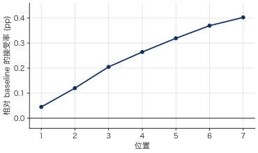{ width="50%" }

<span class="ablation-sq">\(\blacksquare\)</span>**收益也主要出现在训练中后期。** 810–1000 步时，baseline：3.9087，tau loss：3.8614。到 1610–1800 步，baseline：4.7117，tau loss：4.7488。一个可能的原因来自 \(\tau\) 本身的 prefix-product 结构。对较后位置 \(a_i\) 的梯度会乘以前面多个位置的接受率；训练早期各位置预测较弱时，这些乘积较小，因此多步目标对后位置的有效梯度也较弱。随着基础 CE/L1 训练提高前缀接受率，tau objective 才逐渐产生更明显的作用。

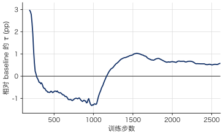{ width="50%" }

### MLA

Attention 换为 MLA 后，末段 \(\tau\) 从 4.9591 降到 4.9368，约 0.45%。token accuracy 从 74.35% 降到 74.00%。CE 1.1191 → 1.1402，L1 0.4550 → 0.4623。可训练参数 \(612.1\mathrm{M}\) vs \(615.2\mathrm{M}\)（\(-0.51\%\)）。

<span class="ablation-sq">\(\blacksquare\)</span>**位置上，损失不随 draft depth 扩大。** 第 1 个位置接受率约 **-0.26 pp**，第 7 个位置约 **-0.15 pp**。后续位置没有额外放大。

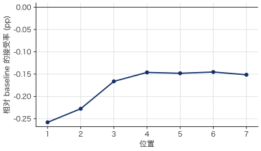{ width="50%" }

<span class="ablation-sq">\(\blacksquare\)</span>**训练全程与 GQA 接近。** 810–1000 步时，baseline：3.9087，MLA：3.9128。到 1610–1800 步，baseline：4.7117，MLA：4.7038。末段才到 -0.45%。

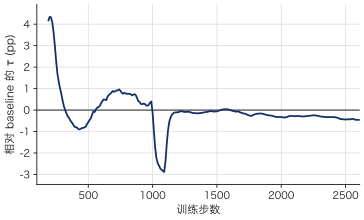{ width="50%" }

<span class="ablation-sq">\(\blacksquare\)</span>**KV cache收益。** 每层每 token 从 2048 压到 576，约 \(3.6\times\)。训练 \(\tau\) 只差 0.45%。

### MLA + SWA

SWA 叠在 MLA 上，history 限制为至多 \(W-1\) 个 token。\(W=1024,512,128\) 相对最大长度 4096 约为 \(1/4\)、\(1/8\)、\(1/32\)。末段 \(\tau\) 相对 MLA：4.9008（−0.73%）、4.8523（−1.71%）、4.6668（−5.47%）。

<span class="ablation-sq">\(\blacksquare\)</span>**窗口越小，各位置接受率下降越大。** SWA128 第 1 个位置约 **-1.49 pp**，第 4–5 个约 **-3.28 pp**，第 7 个约 **-2.94 pp**。块内双向 attention 不能补偿被限制的 target history。

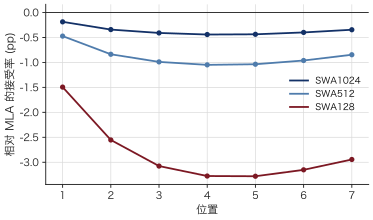{ width="50%" }

<span class="ablation-sq">\(\blacksquare\)</span>**SWA128 相对 MLA 的 \(\tau\) 差在 810–1000 步已接近末段。** 该窗口内 MLA：3.9128，SWA128：3.7498（−4.17%）。SWA1024 同期为 3.9153，末段 −0.73%。

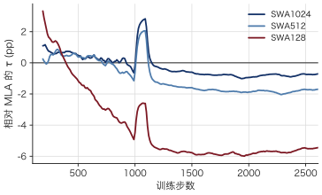{ width="50%" }

<span class="ablation-sq">\(\blacksquare\)</span>**缩短 history 对 \(\tau\) 的影响大于 GQA 换 MLA。** GQA → MLA：−0.45%；MLA → SWA128：−5.47%。若限制 history KV，这一组中 SWA1024 的 \(\tau\) 下降最小。

### Context-only

去掉当前 draft block 的双向 K/V，只保留严格早于 anchor 的 target context。第 1 个位置仍保留 anchor embedding residual，Markov head 仍接收前驱 token。末段 \(\tau\) 从 4.9591 降到 4.8718，约 1.76%。token accuracy 74.35% → 73.30%。CE 1.1191 → 1.1795，L1 0.4550 → 0.4767。

<span class="ablation-sq">\(\blacksquare\)</span>**第 1 个位置接受率几乎不变，下降出现在后续位置。** 第 1 个位置约 **−0.12 pp**，第 2 个约 **−1.56 pp**，第 7 个约 **−0.79 pp**。CE：第 1 个 0.6036 → 0.6090，第 2 个 0.8965 → 0.9910。当前 block 的双向 K/V 主要用于第 2 个及之后位置。

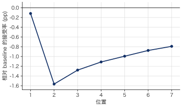{ width="50%" }

<span class="ablation-sq">\(\blacksquare\)</span>**相对 baseline 的 \(\tau\) 差在 810–1000 步已接近末段。** 该窗口内 baseline：3.9087，context-only：3.8379（−1.81%）。1610–1800 步：4.7117 vs 4.6435（−1.45%）。末段 −1.76%。

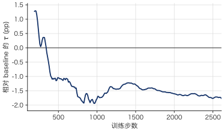{ width="50%" }

<span class="ablation-sq">\(\blacksquare\)</span>**第 1 个位置几乎不依赖当前 block 的 K/V。** 此处第 1 个位置接受率 −0.12 pp；SWA128 在同一位置为 −1.49 pp。该消融去掉的是 block 内双向 K/V，target history 仍完整。

### All-mask

Backbone 输入从 `[anchor, MASK×6]` 改为 `[MASK×7]`，保留块内双向 attention。Markov head 仍接收前驱 token。末段 \(\tau\) 从 4.9591 降到 4.8791，约 1.61%。token accuracy 74.35% → 73.51%。CE 1.1191 → 1.1860，L1 0.4550 → 0.4780。

<span class="ablation-sq">\(\blacksquare\)</span>**下降集中在第 1 个位置，随后逐位置减小。** 第 1 个位置接受率约 **−1.65 pp**，第 2 个约 **−1.19 pp**，第 7 个约 **−0.04 pp**。CE：第 1 个 0.6036 → 0.6978，第 7 个 1.9763 → 1.9983。

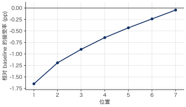{ width="50%" }

<span class="ablation-sq">\(\blacksquare\)</span>**相对 baseline 的 \(\tau\) 差在 810–1000 步大于末段。** 该窗口内 baseline：3.9087，all-mask：3.7809（−3.27%）。1610–1800 步：4.7117 vs 4.6327（−1.68%）。末段 −1.61%。

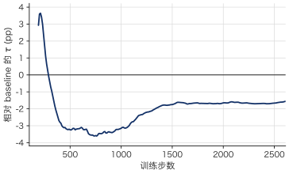{ width="50%" }

<span class="ablation-sq">\(\blacksquare\)</span>**第 1 个位置依赖 backbone 读到 anchor token。** 此处第 1 个位置 −1.65 pp、第 7 个 −0.04 pp；context-only 为 −0.12 pp 与 −0.79 pp。该消融去掉的是 backbone 的 anchor 输入，块内双向 K/V 仍保留。

### 三层 aux

Auxiliary layers 从 `[1, 9, 17, 25, 33]` 改为 `[1, 17, 33]`。输入投影参数 32.77M → 19.66M，可训练参数减少 13.11M，约 2.13%。末段 \(\tau\) 从 4.9591 降到 4.8837，约 1.52%。token accuracy 74.35% → 73.36%。CE 1.1191 → 1.1676，L1 0.4550 → 0.4735。

<span class="ablation-sq">\(\blacksquare\)</span>**接受率下降随位置加深。** 第 1 个位置约 **−0.42 pp**，第 4 个约 **−0.96 pp**，第 7 个约 **−1.15 pp**。CE：第 1 个 0.6036 → 0.6267，第 7 个 1.9763 → 2.0540。

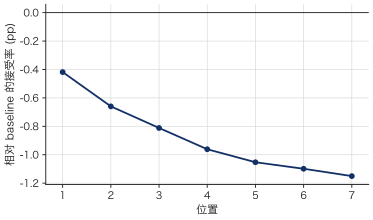{ width="50%" }

<span class="ablation-sq">\(\blacksquare\)</span>**相对 baseline 的 \(\tau\) 差在 810–1000 步大于末段。** 该窗口内 baseline：3.9087，三层 aux：3.7945（−2.92%）。1610–1800 步：4.7117 vs 4.6211（−1.92%）。末段 −1.52%。

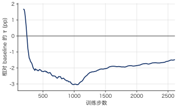{ width="50%" }

### 2.3 epoch

同一 GQA 配置，末段取 5820–6010 步（约 2.3 epoch）。\(\tau\) 从 4.9591 到 5.3611，约 +8.11%。CE 0.8744，L1 0.3721。

<span class="ablation-sq">\(\blacksquare\)</span>**接受率提高随位置加深。** 第 1 个位置约 **+2.59 pp**，第 4 个约 **+5.20 pp**，第 7 个约 **+6.42 pp**。

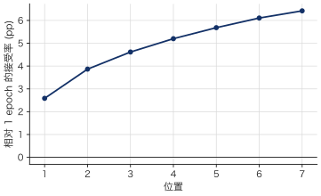{ width="50%" }


<div hidden markdown="1">

### Full-sequence

Full-sequence run 的末段结果为：

* CE：1.4346
* token accuracy：68.58%
* τ：4.7750

这些数值明显低于 response-only baseline，但二者并非同分布比较。

Full-sequence 将 prompt 和 response 都加入监督和 anchor 候选，因此训练指标包含了不同类型的位置。固定每个样本最多 512 个 anchor 后，加入 prompt positions 还会改变 response anchors 获得的监督预算。

因此，该结果目前能说明的是：

**将训练范围扩展到 full sequence 会显著改变 optimizer 实际看到的位置分布。**

它是否提高或降低最终 response speculative decoding quality，需要在固定的 response-only validation positions 上重新评估。同时应记录 prompt / response anchor 数量，判断是否存在监督预算被 prompt 稀释的问题。

</div>

## 总结


**缩短 history 对 \(\tau\) 的影响大于 GQA 换 MLA。** GQA → MLA：−0.45%；MLA → SWA128：−5.47%；MLA → SWA1024：−0.73%。MLA 每层每 token KV 从 2048 压到 576，约 \(3.6\times\)。

**Backbone 的 anchor 输入与块内双向 K/V 作用在不同位置。** All-mask 第 1 个位置 −1.65 pp、第 7 个 −0.04 pp。Context-only 第 1 个 −0.12 pp、第 2 个 −1.56 pp。

**4. Tau loss 提高后续位置接受率，几乎不改 token accuracy。** 末段 \(\tau\) +0.54%。第 1 个位置 +0.045 pp，第 7 个 +0.403 pp。acc 74.35% → 74.34%。该 \(\tau\) 是训练接受长度，不是推理 MAL。

**5. 三层 aux 减少 2.13% 可训练参数，\(\tau\) 下降 1.52%。** 第 1 个位置 −0.42 pp，第 7 个 −1.15 pp。该结果来自无 MTP 的 Qwen3-4B，对于有MTP的模型可能不一样。


