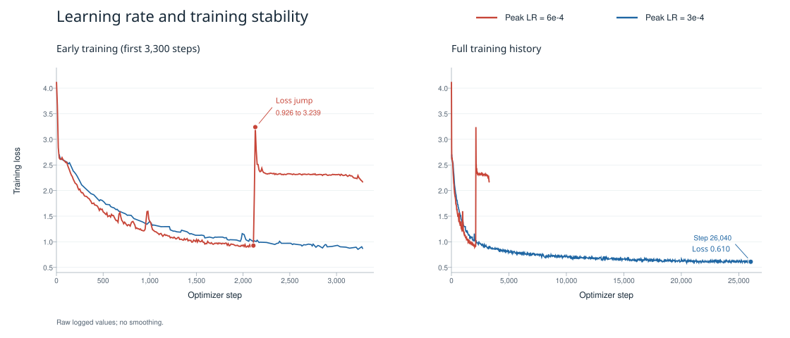

# Qwen3.8-Flash-Next DSpark 训练实验

以 Qwen3.8-Flash-Next 为目标模型（Target），冻结其参数，训练三层 DSpark 草稿模型（draft）。各实验使用相同的数据和隐藏状态缓存，比较不同结构的收敛情况、候选选择和接受长度。

## 实验设置

各组实验共用以下训练设置，结构改动和额外损失在对应章节说明。

| **项目** | 设置 |
| --- | --- |
| **Target** | Qwen3.8-Flash-Next；Target backbone、token embedding 与 LM head 冻结 |
| **训练数据** | PerfectBlend，经 Target 重新生成回复 |
| **离线 cache** | 通过 SGLang 提取并缓存 Target 的 aux hidden states 与 `target_last_hidden_states`；后者经冻结的 LM head 得到 teacher 分布 |
| **验证集** | GSM8K 256 条问题对应的重新生成回复及 hidden cache |
| **最大序列长度** | 4096 tokens，包含 prompt 与 response |
| **Draft 架构** | 3 层；隐藏维度 2560；FFN 中间维度 9728；GQA：24 个 Q heads、2 个 KV heads，head dim 256 |
| **Attention 设置** | 三层均为 full attention，无滑动窗口；Q/K RMSNorm 与 RoPE，RoPE theta 为 \(10^6\) |
| **Aux 层** | `[45, 46, 47]`，按配置中的零基层号记录 |
| **Block size** | 7；Baseline 输入为 `[anchor, MASK × 6]` |
| **Anchor 采样** | 每个样本最多 512 个 |
| **监督** | Response-only |
| **Markov head** | Vanilla，rank 256 |
| **Batch size** | 4 GPUs × micro-batch 4 × 梯度累积 32；global batch 512 |
| **学习率** | 峰值 \(3\times10^{-4}\)；warmup 比例 0.04 |
| **训练计划** | 完整 scheduler 为 26,040 optimizer steps；约 2,604 步 / epoch |
| **Baseline loss** | \(0.1L_{\mathrm{CE}}+0.9L_{\mathrm{L1}}+L_{\mathrm{conf}}\)；位置权重 \(\exp(-i/4)\)，\(i=0,\ldots,6\) |
| **精度与随机种子** | BF16；seed 42 |
| **Checkpoint** | 本组对照实验每 651 步保存一次 |

短程实验沿用完整学习率调度；从 checkpoint 继续训练时，分别记录已有步数与新增步数。

## 数据集

训练使用 [Open PerfectBlend Regenerated with Qwen3.8-Flash-Next](https://huggingface.co/datasets/xpzhao11/open-perfectblend-qwen38-flash-next-regen)：prompt 来自 [mlabonne/open-perfectblend](https://huggingface.co/datasets/mlabonne/open-perfectblend)，response 由 `Qwen/Qwen3.8-Flash-Next` 在 non-thinking 模式下重新生成。采样参数为 temperature 0.7、top-p 0.8、top-k 20、min-p 0，单次最多生成 4096 tokens。

数据共 **1,349,859 条对话记录**、1,790,298 次 assistant 回复；其中 204,494 条为多轮记录，占 15.15%。使用 Target tokenizer 统计截断前的长度：prompt 累计所有非 assistant 消息正文，response 累计所有 assistant 回复正文，总长度按 non-thinking 对话模板编码，包含特殊 token，不追加新回复提示。

截断前，完整对话（含 chat template）共 **1,782,301,322 tokens，约 1.782B**；prompt 正文共 182,134,895 tokens，response 正文共 1,575,153,460 tokens（约 1.575B）。

- **Prompt**：平均 134.9 tokens，中位数 72，P95 为 495，P99 为 973。
- **Response**：平均 1,166.9 tokens，中位数 554，P95 为 4,242，P99 为 7,975。
- **总长度**：平均 1,320.4 tokens，中位数 681，P95 为 4,621，P99 为 8,226。

训练的 4096 tokens 上限包含 prompt 和 response；截断前总长度超过该上限的记录有 **111,429 条，占 8.25%**。多轮记录累计全部回复，因此 response 长度可以超过单次生成上限。

## 评估指标

### 离线指标

给定相同的参考前缀，记 Target 的概率分布（teacher 分布）为 \(p_i\)，draft 的概率分布为 \(q_i\)。两者的分布重叠率为

$$
a_i=\sum_v\min\bigl(p_i(v),q_i(v)\bigr)
=1-\frac12\lVert p_i-q_i\rVert_1.
$$

每个有效 block 的概率接受长度定义为

$$
\tau_{\mathrm{prob}}
=1+\sum_{i=0}^{6}\prod_{j=0}^{i}a_j,
$$

不足 7 个有效位置时，将无效位置的 \(a_i\) 置零，再对有效 block 求平均。各位置的 `accept_rate@i` 按有效 token 数求平均，各 token 等权。离线计算使用参考 token 作为前驱（teacher forcing）。在线推理的平均接受长度（MAL）则由实际生成和 Target 验证得到。

### 推理指标

在线评测记录实际接受长度（MAL）、耗时和 tokens/s，具体配置与统计定义见结果章节。

## 实验分组

| **实验** | 初始化与更新范围 | 比较的问题 |
| --- | --- | --- |
| **Baseline** | 从头训练原 DSpark | 原结构随训练步数增加的收敛情况 |
| **Engram-Markov** | 从头联合训练 draft 与 Engram 门控投影 | Markov head 的 n-gram 条件对接受长度的影响 |
| **Engram-MASK：门控残差** | 从头联合训练 draft、输入投影与逐槽标量门 | 保留 MASK embedding 的门控注入效果 |
| **Engram-MASK：直接替换** | 从头联合训练 draft 与输入投影 | 内容相关输入替代固定 MASK 的效果 |
| **Draft Memory** | 从头训练 draft 与 memory adapter，仅第二阶段回传 | 上一轮 draft 状态对新 anchor 下续写的作用 |
| **Prefix reranker：联合训练** | 从头联合训练 draft 与 reranker | 加入前缀重排后，相对独立 baseline 的效果 |
| **Prefix reranker：冻结基线** | 加载 baseline step 2604，仅训练新加的 reranker | 固定原模型后，重排模块能改善多少 |

## Baseline 架构

Baseline 采用标准 DSpark 结构。三层 draft 主干网络一次生成各预测位置的隐藏状态，LM head 将其映射为初始 logits。Markov head 根据前驱 token 添加偏置，confidence head 预测对应位置的分布重叠率。

{ width="100%" }

图示以 D 为 anchor；实际 block size 为 7，预测 E–K。

### DSpark 主干网络

设 block size 为 \(B\)，token embedding 为 \(E(\cdot)\)。对于前缀 `[... A B C]` 与新 anchor D，draft 输入为

$$
X=[E(D),\underbrace{E(\mathrm{MASK}),\ldots,E(\mathrm{MASK})}_{B-1\text{ 个槽}}],
\qquad B=7.
$$

MASK 槽共享输入 embedding，并使用不同的位置编号。anchor 槽对应 \(h_1\)，用于预测 E，后续槽依次预测 F – K。对 anchor 之前的每个位置 \(j\)，拼接 Target 第 45、46、47 层的隐藏状态，经投影与归一化得到上下文特征：

$$
c_j=\operatorname{RMSNorm}\!\left(
W_{\mathrm{aux}}[H_j^{45};H_j^{46};H_j^{47}]
\right),
\qquad
W_{\mathrm{aux}}:\mathbb R^{7680}\rightarrow\mathbb R^{2560}.
$$

\(W_{\mathrm{aux}}\) 为可训练的无偏置投影。每个 query 可读取 anchor 之前的有效 Target 上下文及自身 block 的全部输入槽；anchor 本身通过 token embedding 输入。

每层的 query 来自当前 draft 隐藏状态，上下文特征与当前 block 隐藏状态分别经过该层的 K/V 投影，沿序列维拼接后在同一次 attention 中读取。三层共享 \(c_j\)，但各层的 Q/K/V 投影参数独立。Draft 状态通过 attention、残差连接和 MLP 逐层更新，最终经 RMSNorm 得到 \(h_1,\ldots,h_B\)，再由冻结的 LM head 并行生成全词表初始 logits \(\ell_1^0,\ldots,\ell_B^0\)。

### Markov 顺序修正

令 \(t_0=D\)，\(t_i\) 为第 \(i\) 个生成位置的 token。Markov head 将前驱 token 映射为低秩表示 \(m_i\)，再投影为词表偏置 \(b_i\)：

$$
\begin{aligned}
m_i&=W_1[t_{i-1}]\in\mathbb R^{256},\\
b_i&=W_2m_i,\\
\ell_i&=\ell_i^0+b_i,\qquad
q_i=\operatorname{softmax}(\ell_i).
\end{aligned}
$$

\(W_1\) 与 \(W_2\) 均参与训练。前驱 token 提供偏置，上下文信息由 \(\ell_i^0\) 提供；greedy 选择 \(\hat t_i=\arg\max_v\ell_i(v)\)。

训练使用参考前驱 token，所有位置的 Markov 修正可并行计算。推理使用实际选出的前驱 token，依次查表、修正 logits 并选择下一个 token。主干网络的隐藏状态在整轮内保持不变。

### Confidence head 与训练目标

Confidence 分支读取 draft 隐藏状态 \(h_i\) 与词表投影之前的 Markov 表示 \(m_i\)，通过线性层与 sigmoid 得到预测值：

$$
s_i=w_c^\top[h_i;m_i]+b_c,
\qquad
\hat a_i=\sigma(s_i).
$$

输入维度为 2816，监督目标为 teacher 与修正后 draft 分布的重叠率 \(a_i\)。标签停止梯度，以二元交叉熵训练 confidence head；token 仍由 logits 选择。

基础损失中，CE 监督记录的下一个 token，L1 拟合 teacher 全词表分布，confidence loss 拟合分布重叠率。三项损失均在有效 response 位置按实验设置中的衰减权重求平均。

## Engram 增强 Markov head

Engram-Markov 在前驱 token 的低秩表示中加入 n-gram 特征，由当前 draft 隐藏状态控制其权重。主干网络与 MASK 输入保持不变。

{ width="100%" }

### 门控与特征注入

沿用 baseline 的位置编号。\(e_{i-1}\in\mathbb R^{2560}\) 为截至前驱 token \(t_{i-1}\) 的 n-gram 查表特征。

Draft 隐藏状态提供 query，Engram 特征提供 key 和 value。记 \(N\) 为无可训练 affine 参数的 RMSNorm，Markov rank 为 \(r=256\)，则

$$
\begin{aligned}
\bar e_{i-1}&=N(e_{i-1}),\\
\mathbf q_i&=N\!\left(W_QN(h_i)\right),\\
\mathbf k_i&=N(W_K\bar e_{i-1}),\qquad
\mathbf v_i=W_V\bar e_{i-1},\\
s_i&=\frac{\mathbf q_i^\top\mathbf k_i}{\sqrt r},\\
g_i&=\sigma\!\left(\operatorname{sign}(s_i)
\sqrt{\max(|s_i|,10^{-6})}\right).
\end{aligned}
$$

各位置独立计算门值，增强后的 Markov 表示与 logits 为

$$
m_i=W_1[t_{i-1}]+g_i\mathbf v_i,
\qquad
\ell_i=\ell_i^0+W_2m_i.
$$

Confidence head 同样读取增强后的 \(m_i\)。

三个无偏置投影均为 \(2560\rightarrow256\)，新增 1.97M 参数。\(W_V\) 零初始化，初始 Engram 残差为零。

### 训练与推理

训练读取参考前驱位置的 Engram 缓存，并行计算各位置的门控与修正；推理随实际生成前缀逐 token 查表。Engram 表另占存储空间，查表和特征传输增加推理耗时。

## Engram 增强 MASK 输入

两种方案均读取 anchor 前一个位置的 Engram 特征，投影后填入六个 MASK 槽，anchor 保留 token embedding，后续使用 vanilla Markov head。设 anchor 位置为 \(a\)，共享特征为

$$
z_a=\operatorname{RMSNorm}(Pe_{a-1}),
\qquad P\in\mathbb R^{2560\times2560}.
$$

\(P\) 为随机初始化的无偏置投影，RMSNorm 无可训练仿射参数。六个槽共享 \(z_a\)，保留各自的位置编号、RoPE 和块内双向 attention。

### 门控残差

{ width="100%" }

$$
u_{a,0}=E(x_a),
\qquad
u_{a,j}=E(\mathrm{MASK})+\tanh(\theta_j)z_a,
\quad j=1,\ldots,6.
$$

每槽一个可训练标量 \(\theta_j\)，由所有样本共享，零初始化后输入与 baseline 相同。门值离开零后，投影 \(P\) 开始获得任务梯度。新增参数为 \(2560^2+6=6{,}553{,}606\)。

### 直接替换

{ width="100%" }

$$
X_a=[E(x_a),\underbrace{z_a,\ldots,z_a}_{6\text{ 个槽}}].
$$

省去标量门，从训练开始替换 MASK embedding。新增参数仅为 \(P\)，共 \(2560^2=6{,}553{,}600\)。

### 训练与推理

训练按 anchor 读取 \(a-1\) 位置的缓存，缺少有效前驱或 block 无效时特征置零，新增参数由基础损失优化。推理每轮查表并投影一次，特征整轮保持不变；查表可在新 anchor 产生前进行，尝试与 Target 计算并行。

## Draft Memory

Draft Memory 保留上一轮 draft 对后续位置的隐藏表示，供下一轮预测使用。训练分两次执行同一个 draft 模型，复用已有 Target 隐藏状态缓存。

{ width="100%" }

### 两阶段训练

第一阶段不输入 memory，也不保留梯度，计算 draft 最终 RMSNorm 后的隐藏表示。LM head 与 Markov head 使用参考前驱 token 选择分数最高的 token，再找到预测与记录序列首次不匹配的位置。首次不匹配之前的前驱与 greedy 生成一致，因此可以用这次并行计算确定新的 anchor。

图中前两个预测匹配、第三个不匹配时，以参考 token F 为新 anchor，上下文扩展至 E。移除 \(h_1,h_2,h_3\)，保留后缀 \(h_4,h_5\)；这些状态来自原 block 前向，选出错误 token 后不重新计算。

第二阶段输入新 anchor、对应的 Target 上下文和保留的 memory，使用参考前驱 token 计算基础训练损失。梯度由这一阶段回传，更新共享 draft 和 memory 适配器。

### Memory 筛选与读取

令旧 anchor 的绝对位置为 \(a\)，block size 为 \(B\)，第 \(i\) 个输出 hidden 为 \(h_i^{\mathrm{old}}\)，其中 \(i=1,\ldots,B\)。该 hidden 的旧 query 位置为 \(a+i-1\)，预测的 token 位置为 \(a+i\)。若连续匹配了 \(m<B\) 个 token，则

$$
a'=a+m+1,\qquad
\mathcal I=\{m+2,\ldots,B\}.
$$

新 anchor 为 \(a'\)。后缀索引集合 \(\mathcal I\) 中的隐藏表示经共享的无偏置线性投影和带可训练尺度参数的 RMSNorm 转换为 memory：

$$
M_i=\operatorname{RMSNorm}_{\gamma}
\left(P\,\operatorname{stopgrad}(h_i^{\mathrm{old}})\right),
\qquad i\in\mathcal I.
$$

\(P\in\mathbb R^{2560\times2560}\) 随机初始化，\(\gamma\) 为可训练归一化尺度；共新增 6,556,160 个参数，由第二阶段损失优化。

Memory 的 RoPE 位置采用预测位置 \(a+i\)，即旧 query 位置编号加一。因此，首条保留状态对齐新 anchor 后的第一个预测位置 \(a'+1\)。图中 \(h_4,h_5\) 分别对齐 G、H。

Adapter 计算一次，得到的同一组 \(M\) 供三层 draft 使用。每层的 query 来自当前 draft 隐藏状态。将正确上下文、memory 和当前 draft 隐藏状态拼接，再通过该层原有的投影得到 K/V。省略归一化与 RoPE 后，可写为

$$
\operatorname{Attn}_{\ell}
\left(
Q_{\ell}(X_{\ell}),
K_{\ell}([H_{\mathrm{ctx}};M;X_{\ell}]),
V_{\ell}([H_{\mathrm{ctx}};M;X_{\ell}])
\right).
$$

其中 \(H_{\mathrm{ctx}}\) 为投影后的正确前缀特征，\(X_\ell\) 为当前层的 draft 隐藏状态。

若整块全部匹配，则转移至记录序列的 bonus 位置，memory 为空。缺少后续监督或跨越回答边界的样本跳过。其余样本保留全部有效后缀。

### 训练与推理

每步训练增加一次无梯度 draft 前向、后缀筛选、memory 投影与 K/V 计算。

在线推理为每个请求保存上一轮 draft 的最终隐藏表示。Target 验证后，移除已接受位置和首次拒绝位置的状态，将剩余后缀按预测位置用于下一轮。各层通过自身投影生成 memory K/V。

训练用参考序列确定拒绝位置，memory 来自未输入 memory 的第一阶段。在线推理由 Target 验证确定拒绝位置，并连续复用上一轮的隐藏状态，因此可能累积更早轮次的 memory 信息。

## Prefix reranker

Prefix reranker 用块内因果 Transformer 编码 anchor 与已选 token，结合当前 draft 隐藏状态，对 Markov top-16 候选进行残差打分，使候选选择利用整个块内前缀。

{ width="100%" }

### 候选与前缀表示

沿用 baseline 记号，训练使用参考 token，推理使用当前轮已选 token。

复用 Markov head 的两张秩为 256 的 token 表 \(E_{\mathrm{in}}\) 与 \(E_{\mathrm{out}}\)，得到原 DSpark 分数

$$
\ell_i(v)=\ell_i^0(v)+E_{\mathrm{in}}(t_{i-1})^\top E_{\mathrm{out}}(v),
\qquad
C_i=\operatorname{Top16}(\ell_i).
$$

候选集合由 Markov 修正后的分数确定。因此，teacher argmax 的候选覆盖率构成重排选择准确率的上界。

Prefix Transformer 的输入为 \([t_0,\ldots,t_{i-1}]\)。各 token 经共享的 \(E_{\mathrm{in}}\) 查表、线性投影并加上可学习的块内位置 embedding。一个 pre-norm 因果 Transformer 层生成前缀表示 \(r_i\)。其宽度为 256，包含 4 个 attention heads，FFN 为 \(256\rightarrow1024\rightarrow256\)，使用 SiLU，输出经过 LayerNorm。

前缀编码范围限于当前 block，历史上下文由 \(h_i\) 提供。

### 残差打分

将 \(h_i\) 投影到 256 维，与 \(r_i\) 拼接，再经过 MLP 和输出投影形成查询向量 \(u_i\)。候选 token 则从共享的 \(E_{\mathrm{out}}\) 查表并投影为 \(k_v\)：

$$
\begin{aligned}
u_i&=W_o\,\operatorname{SiLU}\!\left(W_q[W_hh_i;r_i]+\beta_q\right),\\
k_v&=W_cE_{\mathrm{out}}(v),\\
\Delta_i(v)&=\frac{u_i^\top k_v}{\sqrt{256}},\\
s_i(v)&=\ell_i(v)+\Delta_i(v),\qquad v\in C_i.
\end{aligned}
$$

最终选择为 \(\hat t_i=\arg\max_{v\in C_i}s_i(v)\)。Prefix Transformer 编码前缀一次，候选通过查询向量与投影特征的内积并行评分。

\(W_o\) 零初始化，并列分数优先保留原 DSpark 的选择，因此初始 greedy 选择与原模型一致。

### 重排评估

`train/tau_probabilistic` 和 `eval/tau_probabilistic` 使用重排后的分布：对 top-16 候选的修正分数做 softmax，候选之外的概率置零。Teacher 使用原始全词表分布。重排前的 DSpark 分布也在全词表上归一化。

| **指标** | 含义 |
| --- | --- |
| **`rerank_tau_gain`** | 同一 checkpoint、同一批 anchor 上，重排后与重排前的 \(\tau_{\mathrm{prob}}\) 之差 |
| **`rerank_target_agreement_gain`** | 重排前后选中 teacher argmax 的比例之差；0.02 表示增加 2 个百分点 |
| **`reranker/candidate_recall`** | Teacher argmax 落在 Markov top-16 内的比例 |
| **`rerank_teacher_forced_prefix_gain`** | 与参考 token 序列连续匹配的前缀长度变化，仍在 teacher-forced 输入下计算 |

`rerank_tau_gain` 包含分数修正、top-16 截断和重新归一化的影响；整体效果另与相同训练步数的独立 baseline 比较。

### 训练目标与更新范围

训练沿用现有隐藏状态缓存。每个 block 的前驱输入右移一位，以 anchor 开头，其后为参考序列中的 token。Prefix Transformer 使用因果掩码，一次前向计算编码所有位置。

记 \(p_i\) 为缓存参考前缀对应的 teacher 分布，重排监督标签为

$$
v_i^\star=\arg\max_v p_i(v).
$$

记 \(\mathcal H\) 为有效且 \(v_i^\star\in C_i\) 的位置集合，在这些位置计算候选内的排序 CE：

$$
L_{\mathrm{rank}}
=-\frac{
\sum_{i\in\mathcal H} w_i
\log\frac{\exp s_i(v_i^\star)}
{\sum_{v\in C_i}\exp s_i(v)}
}{
\sum_{i\in\mathcal H}w_i
}.
$$

其中 \(w_i=\exp(-(i-1)/4)\)，求和覆盖 batch 中各 block 的有效命中位置。没有命中位置时，该项为零。联合训练保留重排前的原始 DSpark 目标：

$$
L=L_{\mathrm{base}}+L_{\mathrm{rank}}.
$$

\(L_{\mathrm{base}}\) 为 baseline 的三项损失，监督全部有效位置；排序损失仅监督候选命中位置。联合训练共同更新主干网络和共享 Markov 参数。

冻结基线实验从训练 2,604 步的 baseline 开始，固定主干网络、Markov 和 confidence head，只训练 reranker 的新增参数，并重新初始化优化器与学习率调度。曲线横轴为此前训练步数加上本次新增步数，学习率按本次新增步数调度。

### 推理开销

主干网络每轮只运行一次。第 \(i\) 个位置利用上一个已选 token 更新 Prefix Transformer 的本地 K/V，得到 \(r_i\)，并计算 Markov 修正后的 top-16 候选及其残差分数。选出的 token 进入下一位置，整块候选最后交给 Target 验证。

Prefix K/V 在当前 block 内增长，每轮重新清空。每个 token 的选择依次执行前缀编码、候选筛选和残差评分。

## 在线评测结果

2026 年 10 月 5–8 日，对 baseline 与联合训练的 Prefix reranker 在 step 7812（3 epochs）进行 GSM8K test 全集 1,319 题评测。训练缓存为 non-thinking；离线验证使用 256 题的重新生成回复及 hidden cache。其余结构的在线评测尚未完成。

### 评测设置

两组均在 `dspark-v1.4-prefix-reranker` 分支运行。Baseline 与 reranker 使用各自 step 7812 的导出模型，baseline 沿用原有 anchor 设置和 Markov 修正。

| **项目** | 设置 |
| --- | --- |
| **Target** | Qwen3.8-Flash-Next |
| **接口与 prompt** | `/v1/chat/completions`；5-shot 示例与问题拼接为单条 user message |
| **Thinking** | Non-thinking 设置 `enable_thinking=False`；thinking 去掉该默认项并重启服务 |
| **Target 采样** | Greedy：temperature 0；regen：temperature 0.7、top-p 0.8、top-k 20、min-p 0 |
| **Draft 与验证** | Greedy draft；每轮 7 个候选；关闭 adaptive verification |
| **并行与并发** | Target TP 4；客户端最大并发 256 |
| **长度限制** | 上下文 8,192 tokens；non-thinking 输出上限 1,024 tokens，修正后的 thinking 评测为 4,096 tokens |
| **计分** | 本地 `gsm8k_eval.py` 的答案提取与计分逻辑 |

早期 chat 评测使用 `Question`、`Assistant:`、`<|separator|>` 作为自定义 stop。其中 `Question` 会截断 thinking 中对题目的复述：一条回复仅生成 13 tokens 就停止并计为 invalid，移除 stop 后同题生成 210 tokens 并正确回答。下表 thinking 结果使用修正后的脚本，non-thinking 结果来自此前评测。旧 thinking 结果保留在折叠记录中。

接受统计使用测试前清零的服务端计数，或同一服务评测前后 metrics 快照的差值。记 draft 轮数为 \(R\)，前 \(i\) 个候选连续被接受的轮数为 \(C_i\)，则

$$
A_i=\frac{C_i}{R},
\qquad a_i^{\mathrm{cond}}=\frac{C_i}{C_{i-1}},\quad C_0=R,
\qquad \mathrm{MAL}=1+\frac{\sum_{i=1}^{7}C_i}{R}.
$$

\(A_i\) 为连续接受率，\(a_i^{\mathrm{cond}}\) 为条件接受率，第一位置二者相同。MAL 包含每轮一个 bonus 或纠正 token。整体输出吞吐为总输出 tokens 除以评测总耗时。在线使用实际生成前缀，离线使用参考前缀。

### 整体结果

点击表头可按该列排序，再次点击切换升序或降序。

| 方法 | Target 采样参数 | Draft 采样 | 思考模式 | 准确率 | MAL | 吞吐（tokens/s） |
| --- | --- | --- | --- | ---: | ---: | ---: |
| Baseline | Setting 1 | greedy | non-thinking | 96.7% | 4.9568 | 2,708.712 |
| Prefix reranker | Setting 1 | greedy | non-thinking | 96.9% | 5.0629 | 3,711.9851 |
| Baseline | Setting 2 | greedy | non-thinking | 97.0% | 4.9239 | 2,818.826 |
| Prefix reranker | Setting 2 | greedy | non-thinking | 96.5% | 4.9977 | 3,563.909 |
| Prefix reranker | Setting 2 | greedy | thinking | 97.6% | 3.1763 | 2,857.751 |
| Prefix reranker | Setting 3 | greedy | thinking | 97.3% | 2.8463 | 2,565.931 |

- **Setting 1**：temperature=0、top-p=1.0、top-k=0、min-p=0.0。(vLLM greedy 默认)
- **Setting 2**：temperature=0.7、top-p=0.8、top-k=20、min-p=0，与训练数据 regen 使用的采样参数相同。
- **Setting 3**：temperature=1.0、top-p=0.95、top-k=20、min-p=0。

验证使用标准 rejection sampler。在 greedy draft 下，Setting 1 与 Target argmax 判等；Setting 2 和 Setting 3 在分布上等价于先从 Target 分布采样再判等。

Reranker 的 non-thinking MAL 相对 baseline 在 greedy 和 regen 采样下分别提高 2.14% 和 1.50%。修正 stop 后，thinking 准确率为 97.6%、invalid rate 为 0%，MAL 仍低于 non-thinking。

### 条件接受率

以下由原始计数计算，保留两位小数。

| 方法 | Target 采样参数 | 思考模式 | 位置 1 | 位置 2 | 位置 3 | 位置 4 | 位置 5 | 位置 6 | 位置 7 |
| --- | --- | --- | ---: | ---: | ---: | ---: | ---: | ---: | ---: |
| Baseline | Setting 1 | non-thinking | 92.89% | 88.80% | 84.64% | 80.92% | 76.33% | 70.85% | 66.50% |
| Prefix reranker | Setting 1 | non-thinking | 93.48% | 87.95% | 85.93% | 81.85% | 78.11% | 74.48% | 69.27% |
| Baseline | Setting 2 | non-thinking | 92.50% | 88.45% | 84.41% | 80.46% | 76.83% | 71.30% | 66.77% |
| Prefix reranker | Setting 2 | non-thinking | 92.69% | 87.71% | 85.31% | 81.72% | 78.21% | 73.74% | 69.49% |
| Prefix reranker | Setting 2 | thinking | 66.21% | 69.87% | 75.61% | 76.13% | 74.29% | 71.51% | 68.14% |
| Prefix reranker | Setting 3 | thinking | 59.63% | 66.58% | 73.68% | 74.41% | 72.77% | 69.92% | 66.60% |

Non-thinking 的条件接受率随位置下降，reranker 在两种采样设置下的第 3–7 位均高于 baseline。Thinking 从首位 66.21% 上升至第 4 位 76.13%，随后回落至第 7 位 68.14%。与 non-thinking reranker 的 regen 结果相比，首位低 26.48 个百分点，第 7 位低 1.35 个百分点，差距主要集中在前段。

### 采样参数

Regen 使用与训练回复生成相同的 Target 采样参数，draft 的 greedy 选择保持不变。与 temperature 0 相比，non-thinking baseline 和 reranker 的 MAL 分别降低 0.66% 和 1.29%，逐位置条件接受率的衰减形状基本不变。本次改变采样参数没有改善后段接受率。

Thinking 的 Setting 3 相比 Setting 2，MAL 从 3.1763 降至 2.8463（下降 10.39%），整体接受率从 31.09% 降至 26.38%。准确率分别为 97.3% 和 97.6%，输出吞吐分别为 2,565.931 和 2,857.751 tokens/s。首位条件接受率从 66.21% 降至 59.63%，后续位置下降约 1.52–3.29 个百分点；条件接受率仍先上升再下降，变化主要集中在首位。

Thinking 的准确率低分来自评测 stop 误截断，修正后恢复，但低 MAL 仍存在。两组输出上限和生成内容不同，当前结果尚不能将接受长度差异单独归因于采样参数。

原始计数与连续接受率

| 方法 | Target 采样参数 | 思考模式 | Draft 轮数 | Draft tokens | 接受 tokens | Questions/s | 输出 tokens | 耗时（s） | Invalid |
| --- | --- | --- | ---: | ---: | ---: | ---: | ---: | ---: | ---: |
| Baseline | Setting 1 | non-thinking | 39,720 | 278,040 | 157,166 | 18.253 | 195,738 | 72.262 | 0% |
| Prefix reranker | Setting 1 | non-thinking | 38,100 | 266,700 | 154,796 | 25.5354 | 191,738 | 51.6538 | 0% |
| Baseline | Setting 2 | non-thinking | 40,065 | 280,455 | 157,213 | 18.955 | 196,149 | 69.585 | 0% |
| Prefix reranker | Setting 2 | non-thinking | 39,241 | 274,687 | 156,872 | 24.113 | 194,946 | 54.700 | 0% |
| Prefix reranker | Setting 2 | thinking | 200,139 | 1,400,973 | 435,561 | 5.837 | 645,794 | 225.980 | 0% |
| Prefix reranker | Setting 3 | thinking | 240,210 | 1,681,470 | 443,508 | 4.956 | 682,841 | 266.118 | 0% |

| 方法 | Target 采样参数 | 思考模式 | 位置 1 | 位置 2 | 位置 3 | 位置 4 | 位置 5 | 位置 6 | 位置 7 |
| --- | --- | --- | ---: | ---: | ---: | ---: | ---: | ---: | ---: |
| Baseline | Setting 1 | non-thinking | 36,896 | 32,764 | 27,730 | 22,440 | 17,129 | 12,136 | 8,071 |
| Prefix reranker | Setting 1 | non-thinking | 35,616 | 31,325 | 26,918 | 22,033 | 17,209 | 12,817 | 8,878 |
| Baseline | Setting 2 | non-thinking | 37,059 | 32,780 | 27,670 | 22,263 | 17,104 | 12,195 | 8,142 |
| Prefix reranker | Setting 2 | non-thinking | 36,374 | 31,904 | 27,216 | 22,242 | 17,396 | 12,827 | 8,913 |
| Prefix reranker | Setting 2 | thinking | 132,504 | 92,576 | 70,000 | 53,289 | 39,589 | 28,311 | 19,292 |
| Prefix reranker | Setting 3 | thinking | 143,236 | 95,366 | 70,261 | 52,279 | 38,046 | 26,603 | 17,717 |

| 方法 | Target 采样参数 | 思考模式 | 位置 1 | 位置 2 | 位置 3 | 位置 4 | 位置 5 | 位置 6 | 位置 7 |
| --- | --- | --- | ---: | ---: | ---: | ---: | ---: | ---: | ---: |
| Baseline | Setting 1 | non-thinking | 92.89% | 82.49% | 69.81% | 56.50% | 43.12% | 30.55% | 20.32% |
| Prefix reranker | Setting 1 | non-thinking | 93.48% | 82.22% | 70.65% | 57.83% | 45.17% | 33.64% | 23.30% |
| Baseline | Setting 2 | non-thinking | 92.50% | 81.82% | 69.06% | 55.57% | 42.69% | 30.44% | 20.32% |
| Prefix reranker | Setting 2 | non-thinking | 92.69% | 81.30% | 69.36% | 56.68% | 44.33% | 32.69% | 22.71% |
| Prefix reranker | Setting 2 | thinking | 66.21% | 46.26% | 34.98% | 26.63% | 19.78% | 14.15% | 9.64% |
| Prefix reranker | Setting 3 | thinking | 59.63% | 39.70% | 29.25% | 21.76% | 15.84% | 11.07% | 7.38% |

修正 stop 前的 thinking 记录

以下两组为 temperature 0、每题最多 1,024 tokens，并使用会误截断推理的自定义 stop。

| **指标** | Thinking Baseline | Thinking Reranker |
| --- | --- | --- |
| **GSM8K accuracy** | 76.0% | 76.4% |
| **Invalid rate** | 7.4% | 5.6% |
| **MAL** | 3.1342 | 3.2407 |
| **Draft token acceptance rate** | 30.49% | 32.01% |
| **评测总耗时（s）** | 146.356 | 151.655 |
| **整体输出吞吐（tokens/s）** | 2,863.617 | 2,809.391 |
| **Questions/s** | 9.012 | 8.697 |
| **总输出 tokens** | 419,107 | 426,057 |

| **预测位置** | Baseline 计数 | Reranker 计数 | Baseline 条件接受率 | Reranker 条件接受率 | Baseline 连续接受率 | Reranker 连续接受率 |
| --- | --- | --- | --- | --- | --- | --- |
| **1** | 88,152 | 89,759 | 65.87% | 68.21% | 65.87% | 68.21% |
| **2** | 61,293 | 62,427 | 69.53% | 69.55% | 45.80% | 47.44% |
| **3** | 45,902 | 46,642 | 74.89% | 74.71% | 34.30% | 35.44% |
| **4** | 35,276 | 36,031 | 76.85% | 77.25% | 26.36% | 27.38% |
| **5** | 25,658 | 27,063 | 72.74% | 75.11% | 19.17% | 20.57% |
| **6** | 17,739 | 19,551 | 69.14% | 72.24% | 13.26% | 14.86% |
| **7** | 11,592 | 13,390 | 65.35% | 68.49% | 8.66% | 10.18% |

## 附录

### 学习率与训练稳定性

{ width="100%" }

峰值学习率为 \(6\times10^{-4}\) 时，损失在 step 2110–2130 从约 0.926 突增至 3.239，到 step 3280 仍为 2.168，未恢复至突增前的水平。训练继续运行，但收敛明显退化。

降低峰值学习率至 \(3\times10^{-4}\) 后，训练保持稳定，损失整体下降，step 26040 时约为 0.610。后续实验采用这一学习率。
