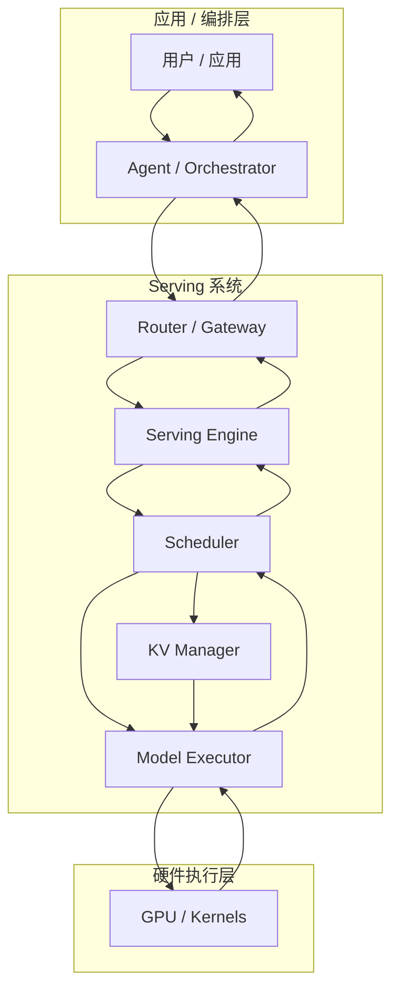
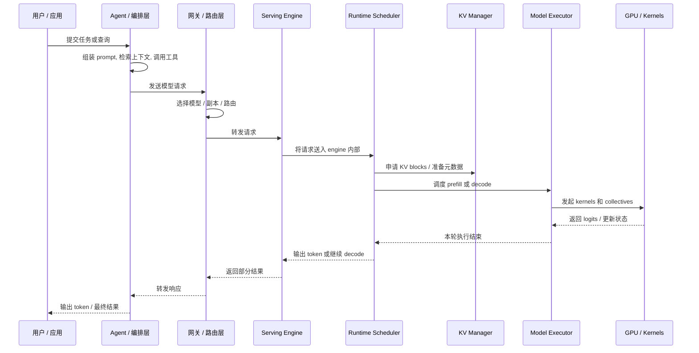

# 推理请求生命周期

在线推理请求一旦表现出“慢”或“不稳定”，根因往往并不显然，因为一条请求在真正产出 token 之前，需要穿过很多层。理解系统时，一个很有用的视角不是只看分层结构，还要看时间顺序：什么先发生，什么在等待什么，延迟和吞吐是在哪一段被消耗掉的。

本页沿着一条请求，从应用层一直跟到 GPU 执行，再回到用户，目的是把抽象的系统分层和真实的执行路径对应起来，让性能分析更具体。

## 为什么要看生命周期

从请求生命周期的角度看问题，是因为很多在 API 边界上看起来相同的现象，底层根因其实完全不同。

- TTFT 高，可能来自 prompt 组装、排队、prefill 成本，或者 runtime 准入延迟。
- 吞吐低，可能来自路由碎片化、batch 不成形、KV 压力，或者 kernel 效率不高。
- 延迟抖动，可能来自上层 fan-out、runtime preemption，或者通信不均衡。

如果只看最终响应时间，这些差异会被全部压扁。生命周期视角的价值，就是把时间花在哪里、由哪一层负责，重新摊开来看。

## 先看请求经过了哪些层

理解这条生命周期，最自然的方式通常不是一上来就看细粒度时序，而是先看请求在系统中的路径。一次推理请求从应用层发起，向下进入 serving 系统，再落到硬件执行层，最后携带着输出 token 沿着同一条链路返回。光是这条路径，本身就已经说明了很多问题：谁在塑造 workload，谁在决定它何时运行，谁在管理状态，谁在真正做计算。

这张图有一个好处，它把现实里很容易混在一起的几类职责拆开了。

### 1. 应用 / 编排层决定进入系统的 workload 长什么样

生命周期真正的起点，其实并不在 serving engine，而是在更上层。聊天系统、编码助手、搜索产品或 workflow service 决定当前是否需要一次模型调用。在 agent 系统里，这里还可能包含工具规划、检索、多轮记忆和 prompt 模板化。

这一层之所以重要，是因为它直接决定了下游要处理什么样的请求。过长的 prompt、激进的 fan-out、重复的检索上下文，或者组织得很差的工具轨迹，都会把负担提前压给下面的 serving system。请求如果在这里就已经膨胀，后面的 scheduler 或 kernel 再高效，也只能是在更重的 workload 上工作。

### 2. Serving 系统把一个 API 请求变成可管理的执行对象

真正的系统复杂度，大多集中在中间这一层。请求到了这里以后，就不再只是一个 payload，而会变成一个需要被路由、调度、分配状态、执行并流式返回的运行时对象。

#### Router / Gateway

路由层决定请求应该被送往哪个模型端点、哪个副本组或哪个 engine 实例。它影响的不只是基础设施利用率，也会直接影响 cache 局部性和 batch 的形成方式。两个前缀相同的请求，是否真的能从 prefix cache 里受益，很大程度上取决于它们有没有被送到同一个 backend。

#### Serving Engine

像 vLLM、SGLang 这样的框架，会在这一层接收请求并把它变成内部 engine 对象。从这里开始，外部 API 的责任就结束了，serving framework 自己的运行时生命周期开始接管。engine 负责请求准入、生命周期追踪和流式输出。

#### Scheduler 和 KV Manager

进入 engine 之后，请求什么时候真正开始运行，要由 scheduler 决定。它可能立刻进入 prefill，也可能先在队列里等待，或者在 continuous batching 下与别的请求交错执行。很多延迟现象之所以难以直觉判断，就是因为请求虽然已经“进了 engine”，却还没有真正推进。

scheduler 也不是单独工作的。它依赖 KV manager 去分配、挂接、复用和回收 KV 状态。prefill 会物化新的 KV blocks，decode 会继续扩展或复用已有 blocks。在内存压力高的时候，scheduler 和 KV manager 之间的边界会变成系统里最关键的控制点之一，因为它决定了 engine 还能不能继续接纳更多工作，还是必须转向更保守的策略。

#### Model Executor

model executor 负责把 runtime 的决策真正翻译成模型执行。它拿到 scheduler 形成的 batch、KV manager 准备好的状态，然后发起 prefill 或 decode。也正是在这一层，调度策略、batch 形状和内存管理开始具体地表现为执行形状。

### 3. 硬件执行层完成真正的计算

最底部才是设备上的真实工作：GEMM、attention kernel、通信 collectives、fused ops、sampling kernels，以及各种内存搬运。算子效率、互联带宽和 kernel launch 开销，都会在这一层体现成最终性能。

如果这一层利用率不高，根因却不一定就在这一层。每个 decode step 工作量太小、并行策略带来过多同步，或者请求流本身始终无法形成高效 batch，都可能最终表现成 GPU 利用率偏低，即使 kernels 本身写得并不差。

### 4. 输出 token 再沿着这条路径返回

每个 decode step 结束后，输出会从 model executor 回到 engine，从 engine 回到 router，再回到应用层，最后送达用户。对流式产品来说，这条返回路径本身就是用户体验的一部分，因为用户感知到的不是“一次性完成”，而是一串带着节奏感的 token。

## 再用时序图看一遍

分层流图回答的是一个结构问题：请求会经过哪些组件。时序图回答的是另一个问题：这些组件在一次请求里是按什么顺序协同工作的。

把这两张图放在一起看，会更容易建立稳定的心智模型。分层流图给出的是系统的固定骨架，时序图给出的是一次请求如何穿过这套骨架。性能问题出现时，更实用的问题通常不是“这一页里提到了哪些组件”，而是“流程图里的哪一个节点出了问题，以及它是在时序上的哪一步开始主导延迟或吞吐”。

## 把常见问题映射到生命周期

同一套生命周期视角，也可以直接用于调试。

- **TTFT 高** 往往来自编排开销、排队、prefill 成本或准入延迟。
- **TPS 低** 往往指向 batch 不成形、KV 压力、通信开销或 kernel 填充不足。
- **Preemption** 通常说明问题出在 scheduler 和 KV manager 的交互边界。
- **Prefix cache 收益差** 常常源于上层路由，而不只是 cache 机制本身。
- **GPU 利用率低** 可能是 decode step 太小、并行拓扑通信太重，或者请求流本身无法形成高效 batch。

## 与其它 AI Infra 页面之间的关系

这个生命周期视角并不是为了替代总览页，而是与总览页互补。

- [总览](overview.md) 解释每个组件在系统里处于哪一层。
- [指标](metrics.md) 解释这条生命周期最终如何被测量。
- [KV Cache](kv-cache.md) 解释 prefill 和 decode 中持续携带的核心状态对象。
- [推理运行时](serving-runtime.md) 解释 scheduler 和 runtime policy 如何改变请求推进方式。
- [并行策略](parallelism.md) 解释请求进入模型计算之后，执行如何分布到多个设备上。
