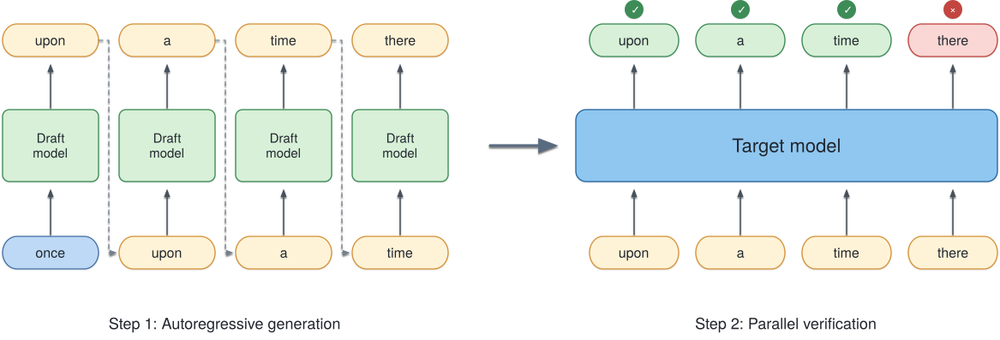

# Speculative Decoding

## 1. Motivation

{ width="80%" }

自回归大模型在生成文本时，decoding 阶段的 token 是逐个产生的。以 “once upon a time there ...” 为例，假设模型已经生成到 **once**，接下来需要生成 **upon → a → time → there**。由于后一个 token 的预测依赖此前已经生成的序列，target model 必须连续执行四次 decode，才能依次得到这四个 token。

在每一步 decode 中，模型实际上只生成一个新的 token。尤其当 batch size 较小时，单次 forward 的计算量并不高，但仍然需要读取已有的 KV cache、执行 GPU kernel，并完成必要的同步。因此，生成四个 token 基本对应四次 target forward 的开销。Speculative decoding 的出发点正是在这里。如果可以先由一个**更小、更快**的模型生成若干候选 token，再让 target model 在一次 forward 中完成验证，就有可能显著减少昂贵的 target decode 次数。

如图所示，draft model 首先连续生成 **upon → a → time → there**。随后，target model 不再逐个生成这些 token，而是在一次 forward 中同时计算多个位置的预测结果，并按照自左向右的顺序进行验证。在这个例子中，**upon、a、time** 均被接受，而 **there** 是第一个被拒绝的 token，因此本轮验证在该位置结束。

这样，原本需要多次 target decode 才能确认的多个 token，可以通过一次 target forward 完成验证，只额外引入若干次成本更低的 draft forward。这构成了 speculative decoding 的基本思想。**由低成本的 draft model 提出候选序列，再利用 target model 并行验证多个候选 token，从而减少昂贵的 target decode 次数。** Draft model 与 target model 的预测越一致，一次 target forward 能够接受的 token 越多，speculative decoding 所带来的加速也就越明显。


## 2. Vanilla Speculative Decoding

### 2.1 Draft

Speculative decoding 的第一步，是让一个更小的 draft model 先向前生成若干个候选 token。继续使用前面的例子，当前 prefix 以 **once** 结尾。如果 draft length 为 \(K=4\)，draft 会连续生成$\text{upon}\rightarrow\text{a}\rightarrow\text{time}\rightarrow\text{there}.$ 形式化地，令当前 prefix 为 \(y\)，draft model 的条件分布为 \(p_d\)。第 \(i\) 个候选 token 按照

$$
x_i\sim p_d(\cdot\mid y,x_{<i})
$$

依次生成，其中 \(x_{<i}=(x_1,\ldots,x_{i-1})\)。因此，draft 阶段本身仍然是 autoregressive 的：生成 \(K\) 个候选 token，依然需要 $K$ 次 draft forward。 这看起来似乎没有减少 forward 次数，关键在于 draft 通常远小于 target。Speculative decoding 实际上是在用 $K$ 次便宜的 draft forward 去换取后面若干次昂贵的 target forward。Draft 生成的 token 也只是候选，真正决定它们能否进入最终输出的仍然是 target。

因此，一个好的 draft 并不需要完全复现 target，只需要同时做到两件事：**生成得足够快，并且经常猜中 target 接下来会接受的 token。** Draft 太大，候选更准但自身开销更高；draft 太小，虽然便宜，却可能频繁被拒绝。这个 trade-off 会直接决定 speculative decoding 最终能获得多少加速。

### 2.2 Verification

Draft 得到 \(K\) 个候选 token 后，target 不需要像正常 decoding 那样再逐个生成。因为整段 candidate sequence 已经给定，target 可以把它们一次性送入模型，在一次 forward 中同时得到每个位置的条件分布

$$
p_t(\cdot\mid y),\quad
p_t(\cdot\mid y,x_1),\quad \ldots,\quad
p_t(\cdot\mid y,x_{<K}).
$$

虽然这些位置在语义上仍然存在先后依赖，但它们的输入 token 已经由 draft 提供，因此 target 可以像 prefill 一样并行计算。回到前面的例子，draft 给出 **upon → a → time → there**，target 只需一次 forward，就能得到这四个位置对应的预测分布。

接下来从左到右验证候选 token。对于第 \(i\) 个 draft token \(x_i\)，其接受概率为

$$
\alpha_i=
\min\left(
1,
\frac{p_t(x_i\mid y,x_{<i})}
     {p_d(x_i\mid y,x_{<i})}
\right).
$$

如果 \(x_i\) 被接受，就继续检查下一个；一旦某个位置被拒绝，它右边的候选全部失效，因为这些 token 都是在被拒绝的 token 条件下生成的。于是图中的 **upon、a、time** 可以连续通过，而 **there** 被拒绝，当前 speculative step 也就在这里结束。

Verification 的收益正来自这里：**target 用一次较宽的 forward，同时检查多个 draft token，再把可以接受的部分一次写入输出。** 如果一次 verification 平均能接受多个 token，就相当于用一次 target forward 替代了多次普通 decode。


### 2.3 Rejection and Resampling

如果第 \(i\) 个候选 token \(x_i\) 被拒绝，那么从 \(x_{i+1}\) 开始的候选都会被丢弃，因为它们是在 \(x_i\) 已经出现的条件下生成的。此时需要由 target 在第 \(i\) 个位置重新生成一个 token，然后结束这一轮 speculative decoding。

这里不能简单地重新从 \(p_t\) 采样。原因是：我们已经知道 \(x_i\) 没有通过前面的 acceptance test，这个 rejection 本身已经改变了当前位置的条件分布。如果忽略这一信息再次直接采样 \(p_t\)，某些 token 会被重复赋予概率，最终生成分布就不再严格等价于 target model。

正确的做法是从 target 与 draft 的**剩余概率质量**中采样：

$$
p_{\mathrm{res}}(x)
=
\frac{
\left[p_t(x)-p_d(x)\right]_+
}{
\sum_{x'}
\left[p_t(x')-p_d(x')\right]_+
},
\qquad
[a]_+=\max(a,0).
$$

直观来看，draft 已经通过候选过程“用掉”了一部分概率质量；当候选被拒绝时，只需要由 target 补上 draft 没有覆盖到的部分。正是 acceptance rule 和 residual resampling 的配合，使 speculative decoding 虽然先让 draft 猜测多个 token，最终得到的采样分布仍然与直接从 target autoregressive decoding 完全一致。


## 3. Why Is Speculative Decoding Exact?

Speculative decoding 改变了 token 的生成过程，但不会改变最终的采样分布。关键在于：draft 负责提出 candidate，acceptance rule 保留 target 与 draft 重叠的概率质量，而 rejection 后的 residual sampling 再补上 target 剩余的部分。

先看一个候选 token \(x\)。Draft 以 \(p_d(x)\) 的概率提出它，并以

$$
\alpha(x)=
\min\left(
1,\frac{p_t(x)}{p_d(x)}
\right)
$$

的概率接受。因此，\(x\) 通过 draft proposal 并最终被接受的概率为

$$
p_d(x)\alpha(x)
=
\min\left(p_d(x),p_t(x)\right).
$$

也就是说，acceptance 恰好保留了 \(p_d\) 和 \(p_t\) 之间重叠的概率质量。对于 target 比 draft 更偏好的 token，这部分还不够，缺少的概率正是

$$
\left[p_t(x)-p_d(x)\right]_+.
$$

当 candidate 被拒绝后，residual distribution 正是按照这部分剩余概率重新采样。因此，对任意 token \(x\)，最终得到它的总概率为

$$
\min\left(p_d(x),p_t(x)\right)
+
\left[p_t(x)-p_d(x)\right]_+
=
p_t(x).
$$

所以，无论一个 token 是由 draft 提出后被接受，还是在 rejection 后通过 residual sampling 得到，最终分布都严格等于 target distribution。这个结论在每一个 decoding position 上都成立，因此 speculative decoding 在加速生成的同时，仍然保持与原始 target autoregressive sampling 完全相同的输出分布。

## 4. Where Does the Speedup Come From?

### 4.1 Acceptance Length

Speculative decoding 的加速首先取决于：一次 target verification 能让生成序列向前推进多少个 token。假设 draft length 为 \(K\)，并且前 \(m\) 个 draft token 被连续接受，那么这一轮至少可以确认这 \(m\) 个 token；在标准 speculative decoding 中，target 还会在 verification 的末尾额外产生一个 token，因此这一轮通常能够推进

$$
m+1
$$

个 token。我们将一次 speculative step 实际推进的 token 数称为 **acceptance length**，其平均值记为

$$
A=\mathbb{E}[\text{tokens advanced per speculative step}].
$$

以 \(K=4\) 为例，如果 draft 给出 **upon → a → time → there**，其中前三个 token 被接受、第四个被拒绝，那么 target 会在第四个位置重新采样一个 token。这一轮最终向前推进 4 个 token，因此 acceptance length 为 4。相反，如果第一个 draft token 就被拒绝，那么这一轮只能推进 1 个 token，此时 speculative decoding 几乎没有利用到并行 verification 的优势。

这里需要区分 **acceptance rate** 和 **acceptance length**。Acceptance rate 描述单个 draft token 被接受的比例，而 acceptance length 直接描述一次昂贵的 target verification 能换来多少个输出 token。对于实际推理性能，后者通常更加重要：**一次 verification 推进得越远，需要执行的 target forward 就越少。** 下一节可以据此建立一个简单的 speedup model，分析 acceptance length、draft cost 和 verification cost 如何共同决定最终加速比。

### 4.2 A Simple Speedup Model

有了 acceptance length，就可以粗略估算 speculative decoding 为什么会更快。假设普通 autoregressive decoding 的一次 target decode 耗时为 \(T_{\mathrm{target}}\)。如果生成 \(A\) 个 token，需要执行 \(A\) 次 target forward，因此时间约为

$$
T_{\mathrm{AR}}
=
A\,T_{\mathrm{target}}.
$$

对于 speculative decoding，假设 draft length 为 \(K\)。一轮 speculative step 需要先执行 \(K\) 次 draft forward，再执行一次 target verification，因此其耗时可以写成

$$
T_{\mathrm{spec}}
=
K T_{\mathrm{draft}}
+
T_{\mathrm{verify}}(K).
$$

如果这一轮平均能够推进 \(A\) 个 token，那么对应的理想化 speedup 为

$$
S
=
\frac{A\,T_{\mathrm{target}}}
{K T_{\mathrm{draft}}+T_{\mathrm{verify}}(K)}.
$$

这个公式也直接说明了 speculative decoding 的三个核心目标：让一次 verification 接受尽可能多的 token，即增大 \(A\)；让 draft 足够轻量，减小 \(T_{\mathrm{draft}}\)；同时控制一次多-token verification 的额外开销 \(T_{\mathrm{verify}}(K)\)。因此，**高 acceptance 并不自动意味着高 speedup**。如果为了提高 acceptance 使用了过大的 draft，或者 verification 本身变得很贵，最终节省下来的 target decode 时间仍然可能抵不过新增的开销。

### 4.3 What Actually Determines the Speedup?

从上一节的公式可以看出，speculative decoding 的性能主要由三个因素决定：acceptance length \(A\)、draft cost \(T_{\mathrm{draft}}\) 和 verification cost \(T_{\mathrm{verify}}(K)\)。其中最直接的是 \(A\)。一次 verification 能接受的 token 越多，就越能摊薄 target forward 的成本；如果 draft 经常在前几个位置就被拒绝，那么即使 verification 能一次处理很多 candidate，大部分计算也没有真正转化成有效输出。

Draft length \(K\) 也存在明显的 trade-off。增大 \(K\) 给了一次 verification 接受更多 token 的机会，但同时需要更多 draft forward，而且越靠后的 candidate 越容易因为前面某个 token 被拒绝而直接作废。因此，\(K\) 并不是越大越好。类似地，更大的 draft model 往往能提高 acceptance，但自身生成 candidate 的成本也更高。一个好的 drafter 追求的不是单纯更准确，而是以尽可能低的代价获得较长的 acceptance length。

Verification 本身也不是免费的。Target 虽然只执行一次 forward，但需要同时处理 \(K\) 个 candidate token，因此

$$
T_{\mathrm{verify}}(K) > T_{\mathrm{target}}
$$

通常是正常的。Speculative decoding 能够加速，是因为一次较宽的 verification 仍然可能比连续执行多次单-token decode 更划算。这个优势还会受到 batch size、KV cache 访问和 GPU utilization 的影响：例如 batch 较大时，普通 target decoding 已经能更充分地利用 GPU，speculative decoding 可以获得的额外收益往往会缩小。

因此，评价一个 speculative decoding 方法时，只看 acceptance rate 并不够。真正需要关心的是：**每次 target verification 最终推进了多少 token，以及为了得到这些 token 额外付出了多少 drafting 和 verification 成本。** 后面的各种 speculative decoding 方法，本质上都在优化这个 trade-off。


## 5. A Systems View of Speculative Decoding
### 5.1 What Changes in a Speculative Step?

前面的 speedup model 把 speculative decoding 简化成 draft cost、verification cost 和 acceptance length。要进一步分析 batch size、通信、MoE 和 KV cache，需要先把一次 speculative step 中发生的工作分开记账。设当前 batch size 为 \(B\)，draft 一次提出 \(K\) 个 candidate，一轮结束后每个请求平均向前推进 \(A\) 个 token。Target verification 实际处理的 query token 数记为 \(q\)；它通常与 \(K\) 同阶，但具体是 \(K\) 还是 \(K+1\) 取决于实现，因此这里不预先固定。

在暂时忽略 draft 与 target 重叠执行的情况下，一轮 speculative decoding 的时间可以写成

\[
C_{\mathrm{spec}}
=
T_{\mathrm{draft}}
+
T_{\mathrm{verify}}(B,q)
+
T_{\mathrm{control}},
\]

其中 \(T_{\mathrm{control}}\) 包括 acceptance、sampling、状态更新等没有包含在模型 forward 中的开销。由于这一轮平均产生 \(A\) 个最终输出 token，每个输出 token 分摊到的时间为

\[
L_{\mathrm{spec}}
=
\frac{C_{\mathrm{spec}}}{A}.
\]

作为对照，普通 autoregressive decoding 在相同 batch 下，每次 target forward 只推进一个 token，其延迟记为 \(L_{\mathrm{AR}}(B)\)。因此，用 baseline 生成同样 \(A\) 个 token，大约需要

\[
A\,L_{\mathrm{AR}}(B),
\]

于是 speculative decoding 的加速条件可以直接写成

\[
T_{\mathrm{draft}}
+
T_{\mathrm{verify}}(B,q)
+
T_{\mathrm{control}}
<
A\,L_{\mathrm{AR}}(B).
\]

这个式子给出了后面系统分析最重要的观察：speculative decoding 并没有消除计算，而是把原来的 \(A\) 次窄 target decode，替换成一次更宽的 verification，同时增加 drafting 和控制开销。把 target 一侧节省出来的时间写成

\[
H
=
A\,L_{\mathrm{AR}}(B)
-
T_{\mathrm{verify}}(B,q),
\]

那么真正能够用于支付额外开销的预算只有 \(H\)。Speculative decoding 能否加速，本质上取决于

\[
T_{\mathrm{draft}}+T_{\mathrm{control}}<H.
\]

接下来的问题因此变得很具体：增大 \(q\) 后，target verification 为什么可能比 \(A\) 次单-token decode 更便宜？这种收益来自更好的计算利用率、权重复用、KV 访问还是更少的通信同步？与此同时，额外的 candidate 又会给通信、MoE routing 和 KV 管理带来多少成本？后面的各节都会围绕这份时间预算展开。

### 5.2 Batch Size, Compute, and Memory Traffic

普通 autoregressive decoding 中，一个 batch 为 \(B\) 的 decode step 只处理 \(B\) 个新 token；而 speculative verification 会同时处理每个请求的多个 candidate。设每个请求送入 target 的 query 数为 \(q\)，那么这一轮共有 \(Bq\) 个 query token。乍看之下，这似乎只是把 batch 从 \(B\) 扩大到了 \(Bq\)，但两者并不完全等价。对于 linear、MLP 等 dense layer，主要看到的是更宽的 token dimension；而对 attention 来说，\(Bq\) 个 query 实际上只属于 \(B\) 条序列，并共享各自已经存在的历史 KV cache。因此，verification 的成本不能只写成 \(Bq\) 的函数，更合适的分解是

\[
T_{\mathrm{verify}}(B,q,\ell)
\approx
T_{\mathrm{dense}}(Bq)
+
T_{\mathrm{attn}}(B,q,\ell)
+
T_{\mathrm{misc}}(B,q),
\]

其中 \(\ell\) 表示历史 context length。对应的 baseline target decode 为

\[
L_{\mathrm{AR}}(B,\ell)
\approx
T_{\mathrm{dense}}(B)
+
T_{\mathrm{attn}}(B,1,\ell)
+
T_{\mathrm{misc}}(B,1).
\]

对 dense layer 来说，speculation 的机会来自把多次很窄的 GEMM 合并成一次更宽的 GEMM。Batch 较小时，一次 decode 中只有 \(B\) 个 token 参与计算，模型权重读取、kernel launch 以及较低的矩阵利用率都会占据较大比例；将宽度扩展到 \(Bq\) 后，这些成本可以被更多 token 分摊。因此，在尚未充分利用 GPU 的区间中，通常可能出现

\[
T_{\mathrm{dense}}(Bq)
<
q\,T_{\mathrm{dense}}(B).
\]

但这种收益不会无限持续。随着 \(B\) 增大，GEMM 逐渐接近设备的计算或带宽利用上限，继续增加 \(q\) 后，dense 部分的延迟会越来越接近随 token 数线性增长。真正决定 speculation 是否划算的也不是上式中的 \(q\)，而是最终推进的 token 数 \(A\)：dense 部分只有满足

\[
T_{\mathrm{dense}}(Bq)
<
A\,T_{\mathrm{dense}}(B)
\]

时，才比生成同样 \(A\) 个 token 的 autoregressive decode 更便宜。

Attention 的情况不同。增加 \(q\) 会增加 query 相关的计算，但这些 query 属于同一条请求，因此都需要访问相同的历史 KV cache。可以把历史 KV 的实际读取放大倍数记为 \(r_{\mathrm{KV}}(B,q,\ell)\)：如果每个 query 都重新从 HBM 读取一遍历史 KV，那么 \(r_{\mathrm{KV}}\) 接近 \(q\)；如果 attention kernel 能够在多个 query 之间有效复用历史 KV，则这个值可以明显更小。只看历史 KV 访问这一部分，speculation 能降低每个输出 token 的成本需要满足

\[
r_{\mathrm{KV}}(B,q,\ell)<A.
\]

这也说明为什么 batch size 本身不足以判断 speculative decoding 的收益。小 batch 时，收益可能主要来自更宽的 dense computation；context 较长时，即使 baseline batch 已经很大，历史 KV 的读取与复用仍然可能成为新的收益来源。相反，如果 dense layer 已经充分饱和，而 attention kernel 又无法在多个 candidate 之间有效复用 KV，那么 verification 增加的大量计算最终只换回少量 accepted token，加速空间就会迅速缩小。因此后面的实验需要同时扫描 \(B\)、\(q\) 和 \(\ell\)，并分别观察 dense computation 与 attention/KV traffic 的变化，而不能仅用一个总 token 数 \(Bq\) 来解释 verification latency。

### 5.3 Communication: Fewer Synchronizations, More Bytes

在 tensor parallel 等分布式推理中，一次 target forward 往往伴随着多次 collective communication。普通 autoregressive decoding 每生成一个 token 都要重新执行这些通信，而 speculative decoding 可以用一次 verification 推进平均 \(A\) 个 token。因此，speculation 首先节省的是 **collective 的重复启动和同步次数**。但与此同时，verification 一次处理 \(q\) 个 query token，通信张量也通常随之变大，因此单次 collective 的数据量会高于普通 decode。

可以先用一个简化模型描述这种 trade-off。设一次普通 target decode 的某条通信路径耗时为

\[
T_{\mathrm{comm}}^{\mathrm{AR}}
=
c_0+\frac{V}{W},
\]

其中 \(c_0\) 表示 collective launch、同步以及固定协议开销，\(V\) 是通信数据量，\(W\) 是有效通信带宽。若 verification 的通信量近似随 query 数 \(q\) 成比例增长，则一次 verification 的通信时间约为

\[
T_{\mathrm{comm}}^{\mathrm{verify}}
=
c_0+\frac{qV}{W}.
\]

为了生成同样平均 \(A\) 个 token，baseline 需要执行 \(A\) 次这样的通信，而 speculative decoding 只在一次 target verification 中执行。因此，仅比较 target 侧这部分通信，speculation 获得收益需要满足

\[
c_0+\frac{qV}{W}
<
A\left(c_0+\frac{V}{W}\right),
\]

整理得到

\[
(A-1)c_0
>
(q-A)\frac{V}{W}.
\]

这个式子很好地刻画了通信侧的收益来源。左边是少执行 \(A-1\) 轮 target communication 所节省的固定启动与同步成本；右边则来自 verification 中那些最终没有转化为输出 token 的额外 candidate。若 \(A\) 接近 \(q\)，大部分 candidate 都被接受，额外 payload 很少浪费，此时 speculation 很容易摊薄 collective latency；如果 rejection 很早，使得 \(A\ll q\)，verification 已经通信过的数据却无法成为有效输出，通信效率就会下降。

实际系统中，\(V/W\) 也不一定与消息大小严格线性。小消息往往更受 latency 和 synchronization 限制，而消息变大后才逐渐进入 bandwidth-bound 区间；collective algorithm、GPU 拓扑和并行方式也可能随消息大小改变。因此，speculative decoding 对通信的影响不能简单总结成“通信次数更少”或“通信量更多”。更准确的说法是：**它把多次小规模 collective 合并成更少的、更宽的 collective，而收益取决于减少的同步成本能否覆盖额外 candidate 带来的通信流量。**

这一点在不同并行方式下还会表现得不同。Tensor parallel 中，verification 通常扩大每次 all-reduce、reduce-scatter 或 all-gather 所处理的 activation；而在 MoE 中，candidate token 还会进一步影响 expert dispatch 和 combine 的流量及负载分布。因此，不能只统计总 communication time，而应该同时观察 collective 次数、message size、有效 bandwidth，以及真正暴露在 critical path 上的同步时间。

### 5.4 MoE: Expert Utilization and Load Imbalance

对于 MoE 模型，speculative verification 的影响比 dense model 更复杂。设一次 verification 中 expert \(e\) 接收到 \(n_e\) 个 token，那么整个 MoE layer 的执行时间不仅取决于总 token 数 \(Bq\)，还取决于这些 token 如何分布到不同 experts 和不同 devices。一个简化的执行时间可以写成

\[
T_{\mathrm{MoE}}
\approx
T_{\mathrm{dispatch}}
+
\max_g T_{\mathrm{expert},g}
+
T_{\mathrm{combine}},
\]

其中 \(g\) 表示一个 expert-parallel rank。这里出现的是 \(\max_g\)，因为下一层通常需要等待最慢的 rank 完成，因此平均每个 expert 收到多少 token 并不能完整描述实际 latency。

Speculation 可能改善 expert computation。普通 decode 中每轮只有 \(B\) 个新 token，经过 routing 后，单个 expert 实际拿到的 micro-batch 可能很小；verification 将 token 数扩大到 \(Bq\) 后，一些 expert 的 GEMM 会变宽，权重读取能够被更多 token 分摊，GPU utilization 也可能提高。对于 expert \(e\)，真正值得比较的不是

\[
T_e(qn_e) \quad \text{和} \quad qT_e(n_e),
\]

而是生成相同 \(A\) 个最终 token 时的成本：只有 verification 后的 expert computation 小于 \(A\) 次普通 decode 的累计成本，这部分才真正贡献 speedup。

但更多 candidate 并不保证 MoE 更高效。不同 candidate 可能被路由到更多 experts，使一次 verification 触达更大的 expert 集合，增加权重访问和 dispatch/combine traffic；也可能集中到少数 experts，使这些 experts 或所在 rank 成为 straggler。尤其需要注意，verification 会先执行整段 candidate 的 routing 和 expert computation，然后才知道哪里发生 rejection。因此，如果第一个或第二个 candidate 就被拒绝，后面的 token 虽然不会成为最终输出，它们已经消耗的 MoE computation 和 communication 并不会被追回。

因此，MoE 场景下 acceptance length \(A\) 仍然不够解释性能，还需要观察 routing pattern。比较 speculative decoding 和普通 decode 时，至少应该同时记录每个 expert 的 token count \(n_e\)、每个 rank 的总 routed tokens、active expert 数量以及最慢 rank 的执行时间。**Speculation 真正有利的情况，是更宽的 verification 能提高 expert 的有效计算效率，同时没有引入足以抵消这一收益的 routing imbalance 和额外 expert-parallel traffic。** 这也是为什么同样的 \(B\)、\(q\) 和 \(A\)，在 dense model 和 MoE model 上可能表现出完全不同的 speedup。

### 5.5 KV Cache: Reuse, Rollback, and Capacity

Speculative verification 一次处理同一请求的多个 query token，而这些 query 共享相同的历史 KV cache。与普通 decode 相比，这给 attention 提供了更强的 KV reuse 机会：如果每个 query 都独立从 HBM 读取一遍历史 KV，那么 verification 的历史读取量会接近普通 decode 的 \(q\) 倍；如果 attention kernel 能在多个 query 之间有效复用已经加载的 K/V，这个放大倍数就会明显降低。设 verification 相对一次普通 decode 的历史 KV 读取放大倍数为 \(r_{\mathrm{KV}}\)，那么生成同样平均 \(A\) 个输出 token 时，仅从历史 KV traffic 来看，speculation 获得收益需要满足

\[
r_{\mathrm{KV}} < A.
\]

Verification 同时也会为整段 candidate 计算并写入新的 KV。问题在于，这些 candidate 是否最终保留，要到 verification 结束后才能确定。假设前 \(m\) 个 draft token 被接受，而第 \(m+1\) 个发生 rejection，那么更靠后的 candidate KV 即使已经完成计算和写入，也不会成为最终序列的一部分。这部分工作可以看作 speculative decoding 的另一种“wasted work”：acceptance 越短，相对于最终输出产生的无效 KV computation 和 memory traffic 就越多。

这里需要区分 **rollback 的逻辑成本** 和 **已经发生的计算成本**。发生 rejection 后，系统通常只需要把有效序列长度恢复到正确的位置，并让后续分配覆盖或重新使用失效的 KV 空间，并不意味着把整个历史 KV cache 重新复制一遍。因此，rollback 本身可以很便宜；真正无法追回的是那些已经为被丢弃 candidate 执行过的 attention、KV projection 和 KV write。

KV cache 还会通过显存容量间接影响系统性能。Speculative decoding 需要为 verification 中尚未确认的 candidate 预留 KV 空间，独立 drafter 还可能维护自己的 KV cache，再加上额外 workspace，这些都会减少同一 GPU 上能够同时驻留的请求数量。因此，即使固定 batch 下 speculative decoding 的单步 latency 更低，也可能出现

\[
B_{\mathrm{SD}} < B_{\mathrm{AR}},
\]

使部分 latency 收益被较低的并发能力抵消。评价 KV cache 对 speculative decoding 的影响时，因此需要同时看三件事：**历史 KV 是否被更有效地复用、被拒 candidate 产生了多少无效 KV 工作，以及额外缓存最终是否压缩了可服务的 batch size。**

### 5.6 From Step Latency to Serving Throughput

前面的分析都以一次 speculative step 为单位，但 serving system 最终关心的是在相同 GPU 资源下能够持续输出多少 token。设 speculative decoding 的一个周期耗时为 \(C_{\mathrm{spec}}\)，每个请求平均推进 \(A\) 个 token，可维持的 batch size 为 \(B_{\mathrm{SD}}\)，那么其输出吞吐可以近似写成

\[
\Theta_{\mathrm{SD}}
=
\frac{B_{\mathrm{SD}}A}{C_{\mathrm{spec}}}.
\]

普通 autoregressive decoding 每一步为每个请求生成一个 token，若其可维持 batch 为 \(B_{\mathrm{AR}}\)，单步延迟为 \(L_{\mathrm{AR}}\)，则

\[
\Theta_{\mathrm{AR}}
=
\frac{B_{\mathrm{AR}}}{L_{\mathrm{AR}}}.
\]

因此，真正的 system-level speedup 应比较

\[
\frac{\Theta_{\mathrm{SD}}}{\Theta_{\mathrm{AR}}}
=
\frac{B_{\mathrm{SD}}}{B_{\mathrm{AR}}}
\cdot
\frac{A\,L_{\mathrm{AR}}}{C_{\mathrm{spec}}}.
\]

第二项正是前面一直分析的 step-level gain，而第一项则描述 speculation 对系统并发能力的影响。这一区分很重要：即使固定 batch 下 \(A\,L_{\mathrm{AR}}/C_{\mathrm{spec}}>1\)，额外的 draft weights、draft KV、candidate KV 和 workspace 仍可能降低 \(B_{\mathrm{SD}}\)，从而抵消一部分甚至全部局部加速。反过来，如果 speculation 显著缩短了 target 的 critical path，同时没有明显压缩可驻留请求数，那么 step-level gain 才更容易转化成实际吞吐提升。

真实 serving 还比固定 batch 模型更复杂。Continuous batching 下，不同请求具有不同 context length、不同 acceptance length，并且会不断进入和离开 batch，因此 \(B\)、\(A\) 和 \(C_{\mathrm{spec}}\) 都随时间变化。这时最可靠的评价方式不是对每轮的 speedup 简单取平均，而是直接测量一段完整 workload 中的

\[
\text{Throughput}
=
\frac{\text{total output tokens}}
{\text{wall-clock time}}.
\]

同时还需要分别观察 TTFT、TPOT 和 tail latency，因为 speculative decoding 会改变 token 输出的时间结构：一次 verification 可能批量确认多个 token，但也引入 drafting 和 verification 的周期性等待。因此，最终评价 speculative decoding 不能停留在 acceptance rate 或单步 latency，而应该回答一个更完整的问题：**在给定硬件、并发负载和延迟约束下，它是否真的让系统以更低的成本持续输出更多 token。**


## Appendix

### Implementation Details

接受与重采样的实现来自 [vLLM](https://github.com/vllm-project/vllm/blob/main/vllm/v1/sample/rejection_sampler.py)。接受条件是 $p(x)/q(x)\ge u$，$u$ 为均匀随机数。`NO_DRAFT_PROBS` 将该 token 的 draft 概率取为 1，条件变成 $p(x)\ge u$。`is_greedy` 的请求在入口返回。重采样核在 $\max(p-q,0)$ 上做 Gumbel-max。代码里的 `q` 是这组随机数，不是提议分布 $q_i$。

<details>
<summary>Triton 中的拒绝采样 kernel</summary>

```python
# NOTE(woosuk): Avoid specialization to prevent unnecessary recompilation.
@triton.jit(do_not_specialize=["max_spec_len"])
def rejection_random_sample_kernel(
    output_token_ids_ptr,  # [batch_size, max_spec_len + 1]
    cu_num_draft_tokens_ptr,  # [batch_size]
    draft_token_ids_ptr,  # [num_tokens]
    draft_probs_ptr,  # [num_tokens, vocab_size] or None
    target_probs_ptr,  # [num_tokens, vocab_size]
    bonus_token_ids_ptr,  # [batch_size]
    recovered_token_ids_ptr,  # [num_tokens]
    uniform_probs_ptr,  # [num_tokens]
    is_greedy_ptr,  # [batch_size]
    max_spec_len,
    vocab_size,
    NO_DRAFT_PROBS: tl.constexpr,
):
    req_idx = tl.program_id(0)
    is_greedy = tl.load(is_greedy_ptr + req_idx)
    if is_greedy:
        # Early exit for greedy sampling requests.
        return

    start_idx = 0 if req_idx == 0 else tl.load(cu_num_draft_tokens_ptr + req_idx - 1)
    end_idx = tl.load(cu_num_draft_tokens_ptr + req_idx)
    num_draft_tokens = end_idx - start_idx

    rejected = False
    for pos in range(num_draft_tokens):
        if not rejected:
            draft_token_id = tl.load(draft_token_ids_ptr + start_idx + pos)
            if NO_DRAFT_PROBS:
                draft_prob = 1
            else:
                draft_prob = tl.load(
                    draft_probs_ptr + (start_idx + pos) * vocab_size + draft_token_id
                )
            target_prob = tl.load(
                target_probs_ptr + (start_idx + pos) * vocab_size + draft_token_id
            )
            uniform_prob = tl.load(uniform_probs_ptr + start_idx + pos)
            # NOTE(woosuk): While the draft probability should never be 0,
            # we check it to avoid NaNs. If it happens to be 0, we reject.
            if draft_prob > 0 and target_prob / draft_prob >= uniform_prob:
                # Accept.
                token_id = draft_token_id
            else:
                # Reject. Use recovered token.
                rejected = True
                token_id = tl.load(recovered_token_ids_ptr + start_idx + pos)
            tl.store(
                output_token_ids_ptr + req_idx * (max_spec_len + 1) + pos, token_id
            )

    if not rejected:
        # If all tokens are accepted, append the bonus token.
        bonus_token_id = tl.load(bonus_token_ids_ptr + req_idx)
        tl.store(
            output_token_ids_ptr + req_idx * (max_spec_len + 1) + num_draft_tokens,
            bonus_token_id,
        )
```

</details>

<details>
<summary>Triton 中的重采样 kernel</summary>

```python
@triton.jit
def sample_recovered_tokens_kernel(
    output_token_ids_ptr,  # [num_tokens]
    cu_num_draft_tokens_ptr,  # [batch_size]
    draft_token_ids_ptr,  # [num_tokens]
    draft_probs_ptr,  # [num_tokens, vocab_size] or None
    target_probs_ptr,  # [num_tokens, vocab_size]
    q_ptr,  # [batch_size, vocab_size]
    vocab_size,
    PADDED_VOCAB_SIZE: tl.constexpr,
    NO_DRAFT_PROBS: tl.constexpr,
):
    req_idx = tl.program_id(0)
    start_idx = 0 if req_idx == 0 else tl.load(cu_num_draft_tokens_ptr + req_idx - 1)
    end_idx = tl.load(cu_num_draft_tokens_ptr + req_idx)
    num_draft_tokens = end_idx - start_idx

    # Early exit for out-of-range positions.
    pos = tl.program_id(1)
    if pos >= num_draft_tokens:
        return

    vocab_offset = tl.arange(0, PADDED_VOCAB_SIZE)
    if NO_DRAFT_PROBS:
        draft_token_id = tl.load(draft_token_ids_ptr + start_idx + pos)
        prob = tl.load(
            target_probs_ptr + (start_idx + pos) * vocab_size + vocab_offset,
            mask=((vocab_offset < vocab_size) & (vocab_offset != draft_token_id)),
            other=0,
        )
    else:
        draft_prob = tl.load(
            draft_probs_ptr + (start_idx + pos) * vocab_size + vocab_offset,
            mask=vocab_offset < vocab_size,
            other=0,
        )
        target_prob = tl.load(
            target_probs_ptr + (start_idx + pos) * vocab_size + vocab_offset,
            mask=vocab_offset < vocab_size,
            other=0,
        )
        prob = tl.maximum(target_prob - draft_prob, 0)
        # NOTE(woosuk): We don't need `prob = prob / tl.sum(prob)` here because
        # `tl.argmax` will select the maximum value.

    q = tl.load(
        q_ptr + req_idx * vocab_size + vocab_offset,
        mask=vocab_offset < vocab_size,
        other=float("-inf"),
    )
    recovered_id = tl.argmax(prob / q, axis=-1)
    tl.store(output_token_ids_ptr + start_idx + pos, recovered_id)
```
</details>

<p class="doc-reference-label"><strong>Reference</strong></p>

<p class="doc-reference">[1] Y. Leviathan, M. Kalman, Y. Matias. Fast Inference from Transformers via Speculative Decoding. ICML, 2023. <a href="https://arxiv.org/pdf/2211.17192">arXiv:2211.17192</a>.</p>

### DSpark 训练记录

- [Qwen3-4B DSpark 训练消融](qwen3-4b-dspark-ablation.md)
- [Qwen3.8-Flash-Next DSpark 训练实验](qwen3.8-flash-next-dspark-training.md)
- [GLM 5.2 DSpark 投机训练设计](glm-5.2-dspark-design.md)

